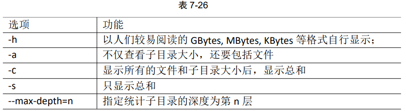

# Linux

## 一、Linux 概述

- Linux 是一个操作系统（OS）

## 二、Linux 安装

1. Linux 的安装


2. VMware 的安装 


详细见pdf

## 三、Linux 文件与目录结构

### 3.1 Linux 文件

Linux 系统中一切皆文件

### 3.2 Linux 目录结构


- /bin：是 Binary 的缩写，这个目录存放着最经常使用的命令

- /sbin：s 就是 Super User 的意思，这里存放的是系统管理员使用的系统管理程序

- /home：存放普通用户的主目录，在 Linux 中每个用户都有一个自己的目录，一般该目录名是以用户的账号命名的

- /root：该目录为系统管理员，也称作超级权限者的用户主目录

- /lib：系统开机所需要最基本的动态连接共享库，其作用类似于 Windows 里的 DLL 文件。几乎所有的应用程序都需要用到这些共享库

- /usr：这是一个非常重要的目录，用户的很多应用程序和文件都放在这个目录下，类似于 windows 下的 progame files 目录

- /boot：这里存放的是启动 Linux 时使用的一些核心文件，包括一些连接文件以及镜像文件，自己的安装别放这里

- /dev：类似于 windows 的设备管理器，把所有的硬件用文件的形式存储。

- /etc：所有的系统管理所需要的配置文件和子目录

- /opt：这是给主机额外安装软件所摆放的目录，比如安装一个 mysql 数据库则就可以放到这个目录下。默认是空的。

- /media：linux 系统会自动识别一些设备，例如U盘、光驱等等，当识别后，linux 会把识别的设备挂载到这个目录下。CentOS7迁移到 /run/media

- /mnt：系统提供该目录是为了让用户临时挂载别的文件系统的。我们可以将外部的存储挂载到 /mnt/ 上，然后进入该目录就可以查看里面的内容了

- /proc：这个目录是一个虚拟的目录，它是系统内存的映射，我们可以通过直接访问这个目录来获取系统信息

- /run：运行目录，存放当前系统运行以来的所有系统信息，是个临时的文件系统，重启后就没了

- /srv：service 缩写，该目录存放一些服务启动之后需要提取的数据

- /sys：存放系统硬件信息的相关文件

- /tmp：这个目录是用来存放一些临时文件的。可以动

- /var：这个目录中存放着不断扩充着的东西，我们习惯将哪些经常被修改的目录放在这个目录下，包括各种日志文件

  

- tmp 目录、opt 目录、home 目录、root 目录、var 目录可以做改变和删除

## 四、VI/VIM 编辑器

### 4.1 vi/vim 是什么

​	VI 是 Unix 操作系统和类 Unix 操作系统中最通用的文本编辑器

​	VIM 编辑器是从 VI 发展出来的一个性能更强大的文本编辑器。可以主动的以字体颜色辨别语法的正确性，方便程序设计。VIM 于 VI 编辑器完全兼容。

### 4.2 测试数据准备

1. 拷贝 /etc/profile 数据到 /root 目录下

   `[root@hadoop100 桌面]# cp /etc/profile /root
   [root@hadoop100 桌面]# cd /root/`

### 4.3 一般模式

以 vi 打开一个档案就直接进入一般模式了（这是默认的模式）。在这个模式中， 你可 以使用『上下左右』按键来移动光标，你可以使用『删除字符』或『删除整行』来处理档 案内容， 也可以使用『复制、粘贴』来处理你的文件数据。


### 4.4 编辑模式

​	在一般模式中可以进行**删除、复制、粘贴等的动作**，但是却无法编辑文件内容的！要 等到你按下『i, I, o, O, a, A』等任何一个字母之后才会进入编辑模式。 

​	注意了！通常在Linux中，按下这些按键时，在画面的左下方会出现『INSERT或 REPLACE』的字样，此时才可以进行编辑。而如果要回到一般模式时， 则必须要按下 『Esc』这个按键即可退出编辑模式。

1. 进入编辑模式

   

2. 退出编辑模式

   按『Esc』键 退出编辑模式，之后所在的模式为一般模式。

### 4.5 指令模式

​	在一般模式当中，输入『 : / ?』3个中的任何一个按钮，就可以将光标移动到最底下那 一行。 

​	在这个模式当中， 可以提供你『搜寻资料』的动作，而读取、存盘、大量取代字符、 离开 vi、显示行号等动作是在此模式中达成的。

1. 基本语法

   

2. 案例实操

   - 强制保存退出

     :wq!

### 4.6 模式间切换


## 五、网络配置和系统管理操作（重点）

### 5.1 查看网络 IP 和网关

1. 查看虚拟网络编辑器

   

2. 修改虚拟网卡 IP

   

3. 查看网关

   

4. 查看 windows 环境中 VMnet8 网络配置

   

### 5.2 配置网络 ip 地址

1. ifconfig 配置网络接口

   ifconfig :network interfaces configuring 网络接口配置 

   - 基本语法

     ifconfig （功能描述：显示所有网络接口的配置信息）

   - 案例实操

     查看当前网络 ip

     `[root@linux100 桌面]# ifconfig`

2. ping 测试主机之间网络连通性

   - 基本语法

     ping 目的主机 （功能描述：测试当前服务器是否可以连接目的主机）

   - 案例实操

     测试当前服务器是否可以连接百度

     `[root@linux100 桌面]# ping www.baidu.com`

3. 修改 ip 地址

   - 查看 ip 配置文件

     `[root@linux100 桌面]#vim /etc/sysconfig/network-scripts/ifcfg-ens33`

     

     以下标红的项必须修改，有值的按照下面的值修改，没有该项的要增加。

     ```
     TYPE="Ethernet" #网络类型（通常是 Ethemet）
     PROXY_METHOD="none"
     BROWSER_ONLY="no"
     BOOTPROTO="static" #IP 的配置方法[none|static|bootp|dhcp]（引导
     时不 使用协议|静态分配 IP|BOOTP 协议|DHCP 协议）
     DEFROUTE="yes"
     IPV4_FAILURE_FATAL="no"
     IPV6INIT="yes"
     IPV6_AUTOCONF="yes"
     IPV6_DEFROUTE="yes"
     IPV6_FAILURE_FATAL="no"
     IPV6_ADDR_GEN_MODE="stable-privacy"
     NAME="ens33"
     UUID="e83804c1-3257-4584-81bb-660665ac22f6" #随机 id
     DEVICE="ens33" #接口名（设备,网卡）
     ONBOOT="yes" #系统启动的时候网络接口是否有效（yes/no）
     #IP 地址
     IPADDR=192.168.1.100
     #网关
     GATEWAY=192.168.1.2
     #域名解析器
     DNS1=192.168.1.2
     ```

     

     修改后：

     

   - 执行 service network restart 重启网络

     `service network restart`

4. 修改 ip 地址后可能会遇到的问题
   1. 物理机能 ping 通虚拟机，但是虚拟机 ping 不通物理机,一般都是因为物理机的 防火墙问题,把防火墙关闭就行 
   2. 虚拟机能 Ping 通物理机,但是虚拟机 Ping 不通外网,一般都是因为 DNS 的设置有 问题 
   3. 虚拟机 Ping www.baidu.com 显示域名未知等信息,一般查看 GATEWAY 和 DNS 设 置是否正确 
   4. 如果以上全部设置完还是不行，需要关闭 NetworkManager 服务
      - systemctl stop NetworkManager 关闭 
      - systemctl disable NetworkManager 禁用 
   5. 如果检查发现 systemctl status network 有问题 需要检查 ifcfg-ens33

### 5.3 配置主机名

1. 修改主机名称

   - 基本语法

     hostname （功能描述：查看当前服务器的主机名称）

   - 案例实操

     1. 查看当前服务器主机名称

        `[root@linux100 桌面]# hostname`

     2. 如果感觉此主机名不合适，我们可以进行修改。通过编辑 /etc/hostname 文件

        `[root@hadoop100 桌面]# vi /etc/hostname`

        修改完成后重启生效。


2. 修改 hosts 映射文件

   - 修改 linux 的主机映射文件 （hosts 文件）

     后续在 hadoop 阶段，虚拟机会比较多，配置通常会采用主机名的方式配置

     比较简单方便，不需要刻意记ip地址

     - 打开 /etc/hosts

       `[root@hadoop100 桌面]# vim /etc/hosts`

       添加以下内容

       ```
       192.168.171.100 linux100
       192.168.171.101 linux101
       192.168.171.102 linux102
       192.168.171.103 linux103
       192.168.171.104 linux104
       192.168.171.105 linux105
       ```

     - 重启设备，重启后，查看主机名，已经修改成功

   - 修改 windows 的主机映射文件 （hosts 文件）

     - 进入 C:\Windows\System32\drivers\etc 路径

     - 打开 hosts 文件并添加如下内容

       ```
       192.168.171.100 linux100
       192.168.171.101 linux101
       192.168.171.102 linux102
       192.168.171.103 linux103
       192.168.171.104 linux104
       192.168.171.105 linux105
       ```

   - 修改 window10/11 的主机映射文件（hosts 文件）

     - 进入 C:\Windows\System32\drivers\etc 路径

     - 拷贝 hosts 文件到桌面

     - 打开桌面 hosts 文件并添加如下内容

       ```
       192.168.171.100 linux100
       192.168.171.101 linux101
       192.168.171.102 linux102
       192.168.171.103 linux103
       192.168.171.104 linux104
       192.168.171.105 linux105
       ```

     - 将桌面 hosts 文件覆盖 C:\Windows\System32\drivers\etc 路径 hosts 文件

## 六、远程登录

​		通常在工作过程中，公司中使用的真实服务器或者是云服务器，都不允许除运维人员 之外的员工直接接触，因此就需要通过远程登录的方式来操作。所以，远程登录工具就是 必不可缺的，目前，比较主流的有 Xshell, SSH Secure Shell, SecureCRT,FinalShell 等，同学 们可以根据自己的习惯自行选择.

## 七、系统管理

### 7.1 Linux 中的进程和服务

​	计算机中，一个正在执行的程序或命令，被叫做“进程”（process）

​	启动之后一直存在、常驻内存的进程，一般被称作“服务”（service）

### 7.2 service 服务管理（centOS 6 了解）

1. 基本语法

   service 服务名 start|stop|restart|status

2. 经验技巧

   查看服务的方法： /etc/init.d/服务名，发现只有两个服务保留在 service （带d，守护进程）

   

### 7.3 systemctl （centOS 7 重点）

1. 基本语法

   systemctl start|stop|restart|status 服务名

2. 经验技巧

   查看服务的方法： /user/lib/systemd/system

3. 案例实操

   

### 7.4 systemctl 设置后台服务的自启动配置

1. 基本语法

   systemctl list-unit-files （功能描述：查看服务开机启动状态） 

   systemctl disable service_name （功能描述：关掉指定服务的自动启动） 

   systemctl enable service_name （功能描述：开启指定服务的自动启动）

2. 案例实操

   1. 开启/关闭 iptables（防火墙）服务的自动启动

      ```
      [root@hadoop100 桌面]# systemctl enable firewalld.service
      [root@hadoop100 桌面]# systemctl disable firewalld.service
      ```

### 7.5 系统运行级别

1. Linux 运行级别【CentOS 6】

   - 运行级别（runlevel）

     

     查看默认级别： vi /etc/inittab

     Linux 系统有七种运行级别（runlevel）：常用的是级别3和5

     - 运行级别0：系统停机状态，系统默认运行级别不能设为0，否则不能正常启动
     - 运行级别1：单用户工作状态，root 权限，用于系统维护，禁止远程登录
     - 运行级别2：多用户状态（没有 NFS），不支持网络
     - 运行级别3：完全的多用户状态（有 NFS），登录后进入控制台命令行模式
     - 运行级别4：系统未使用，保留
     - 运行级别5：X11控制台，登录后进入图形 GUI 模式
     - 运行级别6：系统正常关闭并重启，默认运行级别不能设为6，否则不能正常启动

2. CentOS7 的运行比较简化为：

   multi-user.target 等价于 原运行级别3 （多用户有网，无图形界面）

   graphical.target 等价于 原运行级别5 （多用户有网，有图形界面）

3. 查看当前运行级别

   systemctl get-default

4. 修改当前运行级别

   systemctl set-default TARGET.target  （这里 TARGET 取 multi-user 或者 graphical）

### 7.6 关闭防火墙

1. 临时关闭防火墙

   - 查看防火墙状态

     `[root@linux100 ~]# systemctl status firewalld.service `

   - 临时关闭防火墙

     `[root@linux100 ~]# systemctl stop firewalld`

2. 开机启动时关闭防火墙

   - 查看防火墙开机启动状态

     `[root@linux100 ~]# systemctl enable firewalld.service `

   - 设置开机时关闭防火墙

     `[root@linux100 ~]# systemctl disable firewalld.service `

### 7.7 关机重启命令

​	在 linux 领域内大多用在服务器上，很少遇到关机的操作。毕竟服务器上跑一个服务是永无止境的，除非特殊情况下，不得已才会关机。

1. 基本语法

   （1）sync （功能描述：将数据由内存同步到硬盘中） 

   （2）halt （功能描述：停机，关闭系统，但不断电） 

   （3）poweroff （功能描述：关机，断电） 

   （3）reboot （功能描述：就是重启，等同于 shutdown -r now） 

   （4）shutdown [选项] 时间

   

   ​			shutdown 默认一分钟后关机

   ​			shutdown -c 取消之前的关机操作

   ​			shutdown 15:28 定时关机 

   2. 经验技巧

      ​		Linux 系统中为了提高磁盘的读写效率，对磁盘采取了 “预读迟写”操作方式。当用户保存文件时，Linux 核心并不一定立即将保存数据写入物理磁盘中，而是将数据保存在缓 冲区中，等缓冲区满时再写入磁盘，这种方式可以极大的提高磁盘写入数据的效率。但是，也带来了安全隐患，如果数据还未写入磁盘时，系统掉电或者其他严重问题出现，则将导致数据丢失。使用 sync 指令可以立即将缓冲区的数据写入磁盘。

   3. 案例实操

      （1）将数据由内存同步到硬盘中 

      `[root@hadoop100 桌面]# sync` 

      （2）重启 

      `[root@hadoop100 桌面]# reboot` 

      （3）停机（不断电）

       `[root@hadoop100 桌面]# halt` 

      （4）计算机将在 1 分钟后关机，并且会显示在登录用户的当前屏幕中

       `[root@hadoop100 桌面]# shutdown -h 1 ‘This server will shutdown after 1 mins’` 

      （5）立马关机（等同于 poweroff）

       `[root@hadoop100 桌面]# shutdown -h now` 

      （6）系统立马重启（等同于 reboot）

       `[root@hadoop100 桌面]# shutdown`

## 八、常用基本命令（重要 后六个尤其重要）

​		Shell 可以看作是一个命令解释器，为我们提供了交互式的文本控制台界面。我们可以通过终端控制台来输入命令，由 shell 进行解释并最终交给内核执行。 本章就将分类介绍常用的基本 shell 命令。

### 8.1 帮助命令

1. man 获得帮助信息

   - 基本语法

     man [命令或配置文件] （功能描述：获得帮助信息）

   - 显示说明

     

   - 案例实操

     - 查看 ls 命令的帮助信息

       `[root@linux100 ~]# man ls`

2. help 获得 shell 内置命令的帮助信息

   ​		一部分基础功能的系统命令是直接内嵌在 shell 中的，系统加载启动之后会随着 shell 一起加载，常驻系统内存中。这部分命令被称为“内置（built-in）命令”；相应的其它命令被称为“外部命令”。

   - 基本语法

     help 命令 （功能描述：获得 shell 内置命令的帮助信息）

   - 案例实操

     - 查看 cd 命令的帮助信息

       `[root@linux100 ~]# help cd`

3. 常用快捷键

   

   

### 8.2 文件目录类

#### ①pwd 显示当前工资目录的绝对路径

pwd：print working directory 打印工作目录

- 基本语法

  pwd （功能描述：显示当前工作目录的绝对路径）

- 案例实操

  显示当前工作目录的绝对路径

  `[root@linux100 ~]# pwd
  /root`

#### ②ls 列出目录的内容

ls：list 列出目录内容

- 基本语法

  ls [选项] [目录或是文件]

  . 表示当前目录

  .. 表示上一级目录

  如果一个文件首位为.，说明该文件是一个隐藏文件

- 选项说明

  

- 显示说明

  每行列出的信息依次是： **文件类型与权限 链接数 文件属主 文件属组 文件大小用byte 来表示 建立或最近修改的时间 名字**

- 案例实操

  - 查看当前目录的所有内容

    ```shell
    [root@linux100 sysconfig]# ls -al
    总用量 196
    drwxr-xr-x.   6 root root 4096 5月   2 13:56 .
    drwxr-xr-x. 144 root root 8192 5月   2 14:26 ..
    -rw-r--r--.   1 root root  322 4月  29 09:38 anaconda
    -rw-r--r--.   1 root root  403 10月 31 2018 atd
    -rw-r--r--.   1 root root  484 4月  29 09:37 authconfig
    ```

#### ③cd 切换目录

cd：Change Directory 切换目录

- 基本语法

  cd [参数]

- 参数说明

  

- 案例实操

  - 使用绝对路径切换到 root 目录

    `[root@linux100 ~]# cd /root/`

  - 使用相对路径切换到“公共”的目录

    `[root@linux100 ~]# cd 公共/
    [root@linux100 公共]# `

    同级别目录切换使用相对路径

    `[root@linux100 视频]# cd ../桌面
    [root@linux100 桌面]# `

  - 回到自己的家目录，亦即是 /root/ 这个目录

    `[root@linux100 公共]# cd ~
    [root@linux100 ~]# `

    也可直接输入cd 回到家目录

    `[root@linux100 视频]# cd
    [root@linux100 ~]# `

  - cd- 回到上一次所在的目录

    `[root@linux100 桌面]# cd -
    /root/视频
    [root@linux100 视频]# `

  - 表示回到当前目录的上一级目录，亦即是  “/root/公共” 的上一级目录的意思

    `[root@linux100 视频]# cd ..
    [root@linux100 ~]# `

#### ④mkdir 创建一个新的目录

mkdir：make directory 建立目录

- 基本语法

  mkdir [选项] 要创建的目录

- 选项说明

  

- 案例实操

  - 创建一个目录

    `[root@linux100 ~]# mkdir a
    [root@linux100 ~]# ls
    a  anaconda-ks.cfg  initial-setup-ks.cfg  公共  模板  视频  图片  文档  下载  音乐  桌面
    [root@linux100 ~]# mkdir b c
    [root@linux100 ~]# ls
    a  anaconda-ks.cfg  b  c  initial-setup-ks.cfg  公共  模板  视频  图片  文档  下载  音乐  桌面`

  - 创建一个多级目录

    `[root@linux100 ~]# mkdir d d/e d/e/f
    [root@linux100 ~]# ls
    a  anaconda-ks.cfg  b  c  d  initial-setup-ks.cfg  公共  模板  视频  图片  文档  下载  音乐  桌面
    [root@linux100 ~]# ls d/
    e
    [root@linux100 ~]# ls d/e/
    f`

    简化版

    `[root@linux100 ~]# mkdir -p g/h/i
    [root@linux100 ~]# ls
    a  anaconda-ks.cfg  b  c  d  g  initial-setup-ks.cfg  公共  模板  视频  图片  文档  下载  音乐  桌面
    [root@linux100 ~]# ls g/
    h
    [root@linux100 ~]# ls g/h/
    i`

#### ⑤rmdir 删除一个空的目录

rmdir：Remove directory 移除目录

- 基本语法

  rmdir 要删除的空目录

- 案例实操

  - 删除一个空的文件夹

    `[root@linux100 ~]# rmdir a
    [root@linux100 ~]# ls
    anaconda-ks.cfg  b  c  d  g  initial-setup-ks.cfg  公共  模板  视频  图片  文档  下载  音乐  桌面 `

    

    `[root@linux100 ~]# rmdir b c
    [root@linux100 ~]# ls
    anaconda-ks.cfg  d  g  initial-setup-ks.cfg  公共  模板  视频  图片  文档  下载  音乐  桌面`

    

    `[root@linux100 ~]# rmdir d g
    rmdir: 删除 "d" 失败: 目录非空
    rmdir: 删除 "g" 失败: 目录非空`

    

    `[root@linux100 ~]# rmdir d/e/f d/e d
    [root@linux100 ~]# ls
    anaconda-ks.cfg  g  initial-setup-ks.cfg  公共  模板  视频  图片  文档  下载  音乐  桌面`

    

    `[root@linux100 ~]# rmdir -p g/h/i
    [root@linux100 ~]# ls
    anaconda-ks.cfg  initial-setup-ks.cfg  公共  模板  视频  图片  文档  下载  音乐  桌面`

#### ⑥touch 创建空文件

- 基本语法

  touch 文件名称

- 案例实操

  `[root@linux100 ~]# touch hello
  [root@linux100 ~]# ls
  anaconda-ks.cfg  hello  initial-setup-ks.cfg  公共  模板  视频  图片  文档  下载  音乐  桌面`

  

  `[root@linux100 ~]# touch /home/hy/hello3
  [root@linux100 ~]# ls /home/hy/
  hello2  hello3  公共  模板  视频  图片  文档  下载  音乐  桌面`

  

  vim 创建，如果不输入，退出不会出现文件

  `[root@linux100 ~]# vim hello4
  [root@linux100 ~]# ls
  anaconda-ks.cfg  hello  initial-setup-ks.cfg  公共  模板  视频  图片  文档  下载  音乐  桌面`

  `[root@linux100 ~]# vim hello5
  [root@linux100 ~]# ls
  anaconda-ks.cfg  hello  hello5  initial-setup-ks.cfg  公共  模板  视频  图片  文档  下载  音乐  桌面`

#### ⑦cp 复制问卷或目录

- 基本语法

  cp [选项] source dest  （功能描述：复制 source 文件到 dest）

- 选项说明

  

- 参数说明

  

- 经验技巧

  强制覆盖不提示的方法：\cp

  `[root@linux100 ~]# \cp initial-setup-ks.cfg ../home/hy/`

- 案例实操

  - 复制文件

    `[root@linux100 ~]# cp initial-setup-ks.cfg ../home/hy/
    [root@linux100 ~]# ls /home/hy/
    hello2  initial-setup-ks.cfg  公共  模板  视频  图片  文档  下载  音乐  桌面`

    

    `[root@linux100 ~]# cp initial-setup-ks.cfg ../home/hy/hello2 
    cp：是否覆盖"../home/hy/hello2"？ yes^H^H^H
    [root@linux100 ~]# ls /home/hy/
    hello2  initial-setup-ks.cfg  公共  模板  视频  图片  文档  下载  音乐  桌面
    [root@linux100 ~]# vim /home/hy/hello2 `

    结果如下：

    

  - 递归复制整个文件夹

    `[root@linux100 ~]# mkdir a
    [root@linux100 ~]# ls
    a  anaconda-ks.cfg  initial-setup-ks.cfg  公共  模板  视频  图片  文档  下载  音乐  桌面
    [root@linux100 ~]# cp initial-setup-ks.cfg a
    [root@linux100 ~]# ls a
    initial-setup-ks.cfg
    [root@linux100 ~]# cp -r a/ ../home/hy/
    [root@linux100 ~]# ls /home/hy/
    a  hello2  initial-setup-ks.cfg  公共  模板  视频  图片  文档  下载  音乐  桌面
    [root@linux100 ~]# ls /home/hy/a
    initial-setup-ks.cfg`

#### ⑧rm 删除文件或目录

- 基本语法

  rm [选项] deleteFile （功能描述：递归删除目录中所有内容）

- 选项说明

  

- 案例实操

  - 删除目录中的内容

    `[root@linux100 ~]# rm hello 
    rm：是否删除普通空文件 "hello"？y
    [root@linux100 ~]# ls
    a  anaconda-ks.cfg  initial-setup-ks.cfg  公共  模板  视频  图片  文档  下载  音乐  桌面`

    强制删除

    `[root@linux100 ~]# rm -f hello 
    [root@linux100 ~]# ls
    a  anaconda-ks.cfg  initial-setup-ks.cfg  公共  模板  视频  图片  文档  下载  音乐  桌面`

  - 递归删除目录中所有内容

    `[root@linux100 ~]# rm a
    rm: 无法删除"a": 是一个目录
    [root@linux100 ~]# rm -r a
    rm：是否进入目录"a"? y
    rm：是否删除普通文件 "a/initial-setup-ks.cfg"？y
    rm：是否删除目录 "a"？y
    [root@linux100 ~]# ls
    anaconda-ks.cfg  initial-setup-ks.cfg  公共  模板  视频  图片  文档  下载  音乐  桌面`

    强制删除（谨慎使用）

    `[root@linux100 hy]# rm -rf a
    [root@linux100 hy]# ls
    hello2  initial-setup-ks.cfg  公共  模板  视频  图片  文档  下载  音乐  桌面`

#### ⑨mv 移动文件与目录或重命名

- 基本语法

  - mv oldNameFile newNameFile （功能描述：重命名）
  - mv /temp/movefile/targetFolder (功能描述：移动文件)

- 案例实操

  - 重命名

    `[root@linux100 ~]# mv initial-setup-ks.cfg /home/hy/1.cfg
    [root@linux100 ~]# ls
    anaconda-ks.cfg  公共  模板  视频  图片  文档  下载  音乐  桌面
    [root@linux100 ~]# ls /home/hy/
    1.cfg  hello2  公共  模板  视频  图片  文档  下载  音乐  桌面`

    不加目录默认移动到家目录且重命名

    `[root@linux100 ~]# mv /home/hy/1.cfg initial-setup-ks.cfg
    [root@linux100 ~]# ls
    anaconda-ks.cfg  initial-setup-ks.cfg  公共  模板  视频  图片  文档  下载  音乐  桌面`

    重名名

    `[root@linux100 ~]# mv 2.cfg initial-setup-ks.cfg
    [root@linux100 ~]# ls
    anaconda-ks.cfg  initial-setup-ks.cfg  公共  模板  视频  图片  文档  下载  音乐  桌面`

  - 移动文件

    `[root@linux100 ~]# mv initial-setup-ks.cfg /home/hy/
    [root@linux100 ~]# ls /home/hy/
    hello2  initial-setup-ks.cfg  公共  模板  视频  图片  文档  下载  音乐  桌面`

#### ⑩cat 查看文件内容

查看问卷内容，从第一行开始显示

- 基本语法

  cat [选项] 要查看的文件

- 选项说明

  

- 经验技巧

  一般查看比较小的文件，一屏幕能显示全的

- 案例实操

  - 查看问卷内容并显示行号

    `[root@linux100 ~]# cat -n initial-setup-ks.cfg `

#### ⑪more 文件内容分屏查看器

more 指令是一个基于 VI 编辑器的文本过滤器，它以全屏幕的方式按页显示文本文件 的内容。more 指令中内置了若干快捷键，详见操作说明。

- 基本语法

  more 要查看的文件

- 操作说明

  

  

- 案例实操

  - 采用 more 查看文件

    `[root@linux100 ~]# more initial-setup-ks.cfg `

#### ⑫less 分屏显示文件内容

less 指令用来分屏查看文件内容，它的功能与 more 指令类似，但是比 more 指令更加强大，支持各种显示终端。less 指令在显示文件内容时，并不是一次将整个文件加载之后才显示，而是根据显示需要加载内容，对于显示大型文件具有较高的效率。

- 基本语法

  less 要查看的文件

- 操作说明

  

- 经验技巧

  用SecureCRT时[pagedown]和[pageup]可能会出现无法识别的问题。

- 案例实操

  - 采用 less 查看文件

    `[root@linux100 ~]# less initial-setup-ks.cfg `

#### ⑬echo

echo 输出内容到控制台

- 基本语法

  echo [选项] [输出内容]

  选项：

  -e：支持反斜线控制的字符转换

  

  

- 案例实操

  `[root@linux100 ~]# echo hello,world
  hello,world
  [root@linux100 ~]# echo hello world
  hello world
  [root@linux100 ~]# echo hello   world
  hello world
  [root@linux100 ~]# echo "hello     world"
  hello     world
  [root@linux100 ~]# echo "hello \ world"
  hello \ world
  [root@linux100 ~]# echo -e "hello\nworld"
  hello
  world`

  查看系统变量

  `[root@linux100 ~]# echo $USER 
  hy
  [root@linux100 ~]# echo $PATH 
  /usr/local/sbin:/usr/local/bin:/usr/sbin:/usr/bin:/root/bin`

#### ⑭head 显示文件头部内容

head 用于显示文件的开头部分内容，默认情况下 head 指令显示文件的前 10 行内容。

- 基本语法

  - head 文件 （功能描述：查看文件头10行内容）

  - head -n 5 文件 （功能描述：查看文件头5行内容，5可以是任意行数）

- 选项说明

  

- 案例实操

  - 查看文件的头2行

    `[root@linux100 ~]# head -n 2 info 
    anaconda-ks.cfg
    info`

#### ⑮tail 输出文件尾部内容

tail 用于输出文件中尾部的内容，默认情况下 tail 指令显示文件的后 10 行内容。

- 基本语法

  - tail 文件 （功能描述：查看文件尾部10行内容）
  - tail -n 5 文件 （功能描述：查看文件尾部5行内容，5可以是任意行数）
  - **tail -f  文件 （功能描述：实时追踪该文档的所有更新）**
    1. ctrl + s 暂停
    2. ctrl + q 继续
    3. ctrl + c 退出

- 选项说明

  

- 案例实操

  - 查看文件尾 1 行内容

    `[root@linux100 ~]# tail -n 1 info 
    linux100`

  - 实时追踪该档的所有更新

    `[root@linux100 ~]# tail -f info 
    drwxr-xr-x. 2 root root    6 4月  29 14:21 公共
    drwxr-xr-x. 2 root root    6 4月  29 14:21 模板
    drwxr-xr-x. 2 root root    6 4月  29 14:21 视频
    drwxr-xr-x. 2 root root    6 4月  29 14:21 图片
    drwxr-xr-x. 2 root root    6 4月  29 14:21 文档
    drwxr-xr-x. 2 root root    6 4月  29 14:21 下载
    drwxr-xr-x. 2 root root    6 4月  29 14:21 音乐
    drwxr-xr-x. 2 root root   34 5月   1 15:44 桌面
    hello linux
    linux100`

    打开另一个终端进行操作：

    `[root@linux100 ~]# echo $HOSTNAME >> info `

    结果显示：

    `[root@linux100 ~]# tail -f info 
    drwxr-xr-x. 2 root root    6 4月  29 14:21 公共
    drwxr-xr-x. 2 root root    6 4月  29 14:21 模板
    drwxr-xr-x. 2 root root    6 4月  29 14:21 视频
    drwxr-xr-x. 2 root root    6 4月  29 14:21 图片
    drwxr-xr-x. 2 root root    6 4月  29 14:21 文档
    drwxr-xr-x. 2 root root    6 4月  29 14:21 下载
    drwxr-xr-x. 2 root root    6 4月  29 14:21 音乐
    drwxr-xr-x. 2 root root   34 5月   1 15:44 桌面
    hello linux
    linux100
    linux100`

#### ⑯> 输出重定向和 >> 追加

- 基本语法

  - ls -l > 文件 （功能描述：列表的内容写入文件a.txt中（**覆盖写**））
  - ls -al >> 文件 （功能描述：列表的内容**追加**到文件aa.txt的末尾）
  - cat 文件1 > 文件2 （功能描述：将文件 1 的内容覆盖到文件 2）
  - echo "内容" >> 文件

- 案例实操

  - 将 ls 查看信息写入到文件中

    `[root@linux100 ~]# ll > info2
    [root@linux100 ~]# cat info2
    总用量 12
    -rw-------. 1 root root 1838 4月  29 09:38 anaconda-ks.cfg
    -rw-r--r--. 1 root root  738 5月   2 16:34 info
    -rw-r--r--. 1 root root    0 5月   2 16:38 info2
    -rw-r--r--. 1 root root 1886 4月  29 09:45 initial-setup-ks.cfg
    drwxr-xr-x. 2 root root    6 4月  29 14:21 公共
    drwxr-xr-x. 2 root root    6 4月  29 14:21 模板
    drwxr-xr-x. 2 root root    6 4月  29 14:21 视频
    drwxr-xr-x. 2 root root    6 4月  29 14:21 图片
    drwxr-xr-x. 2 root root    6 4月  29 14:21 文档
    drwxr-xr-x. 2 root root    6 4月  29 14:21 下载
    drwxr-xr-x. 2 root root    6 4月  29 14:21 音乐
    drwxr-xr-x. 2 root root   34 5月   1 15:44 桌面`

  - 将 ls 查看信息追加到文件中

    `[root@linux100 ~]# ls >> info2
    [root@linux100 ~]# cat info2
    总用量 12
    -rw-------. 1 root root 1838 4月  29 09:38 anaconda-ks.cfg
    -rw-r--r--. 1 root root  738 5月   2 16:34 info
    -rw-r--r--. 1 root root    0 5月   2 16:38 info2
    -rw-r--r--. 1 root root 1886 4月  29 09:45 initial-setup-ks.cfg
    drwxr-xr-x. 2 root root    6 4月  29 14:21 公共
    drwxr-xr-x. 2 root root    6 4月  29 14:21 模板
    drwxr-xr-x. 2 root root    6 4月  29 14:21 视频
    drwxr-xr-x. 2 root root    6 4月  29 14:21 图片
    drwxr-xr-x. 2 root root    6 4月  29 14:21 文档
    drwxr-xr-x. 2 root root    6 4月  29 14:21 下载
    drwxr-xr-x. 2 root root    6 4月  29 14:21 音乐
    drwxr-xr-x. 2 root root   34 5月   1 15:44 桌面
    anaconda-ks.cfg
    info
    info2
    initial-setup-ks.cfg
    公共
    模板
    视频
    图片
    文档
    下载
    音乐
    桌面`

  - 采用 echo 将 hello 单词追加到文件中

    `[root@linux100 ~]# echo hello >> info2
    [root@linux100 ~]# tail info2
    initial-setup-ks.cfg
    公共
    模板
    视频
    图片
    文档
    下载
    音乐
    桌面
    hello`

#### ⑰ln 软链接

软链接也称为符号链接，类似于 windows 里的快捷方式，有自己的数据块，主要存放了链接其他文件的路径。

- 基本语法

  ln -s [原文件或目录] [软链接名] （功能描述：给原文件创建一个软链接）

- 经验技巧

  删除软链接：rm -rf 软链接名，而不是 rm -rf 软链接名/

  **如果使用 rm -rf 软链接名/ 删除，会把软链接对应的真实目录下内容删掉**

  查询：通过 ll 就可以查看，列表属性第 1 位是 l，尾部会有位置指向。

- 案例实操

  - 创建文件软链接

    `[root@linux100 ~]# cd /home/hy/
    [root@linux100 hy]# ln -s /root/info myInfo
    [root@linux100 hy]# ls
    hello2  myInfo  公共  模板  视频  图片  文档  下载  音乐  桌面
    [root@linux100 hy]# ls -l
    总用量 4
    -rw-r--r--. 1 root root 1886 5月   2 15:13 hello2
    lrwxrwxrwx. 1 root root   10 5月   2 16:49 myInfo -> /root/info
    drwxr-xr-x. 2 hy   hy      6 4月  29 09:45 公共
    drwxr-xr-x. 2 hy   hy      6 4月  29 09:45 模板
    drwxr-xr-x. 2 hy   hy      6 4月  29 09:45 视频
    drwxr-xr-x. 2 hy   hy      6 4月  29 09:45 图片
    drwxr-xr-x. 2 hy   hy      6 4月  29 09:45 文档
    drwxr-xr-x. 2 hy   hy      6 4月  29 09:45 下载
    drwxr-xr-x. 2 hy   hy      6 4月  29 09:45 音乐
    drwxr-xr-x. 2 hy   hy      6 4月  29 09:45 桌面`

  - 创建目录软链接

    `[root@linux100 hy]# ln -s /root/folder/ /home/hy/myFolder
    [root@linux100 hy]# ls
    hello2  myFolder  myInfo  公共  模板  视频  图片  文档  下载  音乐  桌面
    [root@linux100 hy]# ll
    总用量 4
    -rw-r--r--. 1 root root 1886 5月   2 15:13 hello2
    lrwxrwxrwx. 1 root root   13 5月   2 16:52 myFolder -> /root/folder/
    lrwxrwxrwx. 1 root root   10 5月   2 16:49 myInfo -> /root/info
    drwxr-xr-x. 2 hy   hy      6 4月  29 09:45 公共
    drwxr-xr-x. 2 hy   hy      6 4月  29 09:45 模板
    drwxr-xr-x. 2 hy   hy      6 4月  29 09:45 视频
    drwxr-xr-x. 2 hy   hy      6 4月  29 09:45 图片
    drwxr-xr-x. 2 hy   hy      6 4月  29 09:45 文档
    drwxr-xr-x. 2 hy   hy      6 4月  29 09:45 下载
    drwxr-xr-x. 2 hy   hy      6 4月  29 09:45 音乐
    drwxr-xr-x. 2 hy   hy      6 4月  29 09:45 桌面`

  - 删除软链接（注意不要写最后的/）

    `[root@linux100 hy]# rm myInfo 
    rm：是否删除符号链接 "myInfo"？y
    [root@linux100 hy]# ls
    hello2  myFolder  公共  模板  视频  图片  文档  下载  音乐  桌面`

    `[root@linux100 hy]# rm -rf myFolder
    [root@linux100 hy]# ls
    hello2  公共  模板  视频  图片  文档  下载  音乐  桌面`

  - 进入软链接实际路径

    `[root@linux100 myFolder]# pwd -P
    /root/folder`

#### ⑱history 查看已经执行过历史命令

- 基本语法

  history （功能描述：查看已经执行过历史命令）

- 案例实操

  - 查看已经执行过的历史命令

    `[root@linux100 ~]# history `

### 8.3 时间日期类

- 基本语法

  date [OPTION]... [+FORMAT]

- 选项说明

  

- 参数说明

  

#### ①date 显示当前时间

- 基本语法

  - date （功能描述：显示当前时间）
  - date +%Y （功能描述：显示当前年份）
  - date +%m （功能描述：显示当前月份）

  - date +%d （功能描述：显示当前是哪一天）

  - date +%Y-%m-%d %H:%M:%S （功能描述：显示当前年月日时分秒）

- 案例实操

  - 显示当前时间信息

    `[root@linux100 ~]# date
    2022年 05月 02日 星期一 17:14:34 CST`

  - 显示当前时间年月日

    `[root@linux100 ~]# date +%Y%m%d
    20220502`

  - 向上当前时间年月日时分秒

    `[root@linux100 ~]# date +"%Y-%m-%d %H:%M:%S"
    2022-05-02 17:15:46`

#### ②date 显示非当前时间

- 基本语法

  - date -d '1 days ago' （功能描述：显示前一天时间）
  - date -d '-1 days ago' （功能描述：显示明天时间）

- 案例实操

  - 显示前一天

    `[root@linux100 ~]# date -d '1 days ago'
    2022年 05月 01日 星期日 17:21:17 CST`

  - 显示明天时间

    `[root@linux100 ~]# date -d '-1 days ago'
    2022年 05月 03日 星期二 17:21:37 CST`

#### ③date 设置系统时间

- 基本语法

  date -s 字符串时间

- 案例实操

  - 设置系统当前时间

    `[root@linux100 ~]# date -s "2017-06-19 20:52:18"`

#### ④cal 查看日历

- 基本语法

  cal [选项] （功能描述：不加选项，显示本月日历）

- 选项说明

  

- 案例实操

  - 查看当前月的日历

    `[root@linux100 ~]# cal
          五月 2022     
    日 一 二 三 四 五 六
     1  2  3  4  5  6  7
     8  9 10 11 12 13 14
    15 16 17 18 19 20 21
    22 23 24 25 26 27 28
    29 30 31`

  - 查看 2017 年的日历 

    `[root@linux100 ~]# cal 2017
                                   2017           `                    

            一月                   二月                   三月        
    `日 一 二 三 四 五 六   日 一 二 三 四 五 六   日 一 二 三 四 五 六
     1  2  3  4  5  6  7             1  2  3  4             1  2  3  4
     8  9 10 11 12 13 14    5  6  7  8  9 10 11    5  6  7  8  9 10 11
    15 16 17 18 19 20 21   12 13 14 15 16 17 18   12 13 14 15 16 17 18
    22 23 24 25 26 27 28   19 20 21 22 23 24 25   19 20 21 22 23 24 25
    29 30 31               26 27 28               26 27 28 29 30 31`

            四月                   五月                   六月        
    `日 一 二 三 四 五 六   日 一 二 三 四 五 六   日 一 二 三 四 五 六
                       1       1  2  3  4  5  6                1  2  3
     2  3  4  5  6  7  8    7  8  9 10 11 12 13    4  5  6  7  8  9 10
     9 10 11 12 13 14 15   14 15 16 17 18 19 20   11 12 13 14 15 16 17
    16 17 18 19 20 21 22   21 22 23 24 25 26 27   18 19 20 21 22 23 24
    23 24 25 26 27 28 29   28 29 30 31            25 26 27 28 29 30
    30
            七月                   八月                   九月        
    日 一 二 三 四 五 六   日 一 二 三 四 五 六   日 一 二 三 四 五 六
                       1          1  2  3  4  5                   1  2
     2  3  4  5  6  7  8    6  7  8  9 10 11 12    3  4  5  6  7  8  9
     9 10 11 12 13 14 15   13 14 15 16 17 18 19   10 11 12 13 14 15 16
    16 17 18 19 20 21 22   20 21 22 23 24 25 26   17 18 19 20 21 22 23
    23 24 25 26 27 28 29   27 28 29 30 31         24 25 26 27 28 29 30
    30 31
            十月                  十一月                 十二月       
    日 一 二 三 四 五 六   日 一 二 三 四 五 六   日 一 二 三 四 五 六
     1  2  3  4  5  6  7             1  2  3  4                   1  2
     8  9 10 11 12 13 14    5  6  7  8  9 10 11    3  4  5  6  7  8  9
    15 16 17 18 19 20 21   12 13 14 15 16 17 18   10 11 12 13 14 15 16
    22 23 24 25 26 27 28   19 20 21 22 23 24 25   17 18 19 20 21 22 23
    29 30 31               26 27 28 29 30         24 25 26 27 28 29 30
                                                  31`

### 8.4 用户管理命令

#### ①useradd 添加新用户

- 基本语法

  - useradd 用户名 （功能描述：添加新用户）
  - useradd -g 组名 用户名 （功能描述：添加新用户到某个组）

- 案例实操

  - 添加一个用户

    `[root@linux100 home]# useradd tony
    [root@linux100 home]# ls
    Documents  hy  tony`

#### ②passwd 设置用户密码

- 基本语法

  - passwd 用户名 （功能描述：设置用户密码）

- 案例实操

  - 设置用户的密码

    `[root@linux100 home]# passwd tony
    更改用户 tony 的密码 。
    新的 密码：
    无效的密码： 密码未通过字典检查 - 过于简单化/系统化
    重新输入新的 密码：
    passwd：所有的身份验证令牌已经成功更新。`

#### ③id 查看用户是否存在

- 基本语法

  - id 用户名

- 案例实操

  - 查看用户是否存在

    `[root@linux100 home]# id tony
    uid=1001(tony) gid=1001(tony) 组=1001(tony)`

#### ④cat /etc/passwd 查看创建了哪些用户

- 案例实操

  `[root@linux100 home]# cat /etc/passwd`

#### ⑤su 切换用户

su：switch user 切换用户

- 基本语法

  - su 用户名称 （功能描述：切换用户，只能获得用户的执行权限，不能获得环境变量）
  - su - 用户名称 （功能描述：切换到用户并获得该用户的环境变量及执行权限）

- 案例实操

  - 切换用户

    `[root@linux100 home]# su hy
    [hy@linux100 home]$ echo $PATH 
    /usr/local/sbin:/usr/local/bin:/usr/sbin:/usr/bin:/root/bin
    [hy@linux100 home]$ exit 
    exit
    [root@linux100 home]# su - hy
    上一次登录：一 5月  2 17:57:02 CST 2022pts/1 上
    [hy@linux100 ~]$ echo $PATH 
    /usr/local/bin:/bin:/usr/bin:/usr/local/sbin:/usr/sbin:/home/hy/.local/bin:/home/hy/bin`

#### ⑥userdel 删除用户

- 基本语法

  - userdel 用户名 （功能描述：删除用户但保存用户主目录）
  - userdel -r 用户名 （功能描述：用户和用户主目录，都删除）

- 选项说明

  

- 案例实操

  - 删除用户但保存主目录

    `[root@linux100 home]# userdel tony`

    `[root@linux100 home]# ls
    dave  Documents  hy  tony
    [root@linux100 home]# id tony
    id: tony: no such user`

  - 删除用户和用户主目录，都删除

    `[root@linux100 home]# userdel -r david
    [root@linux100 home]# ls
    Documents  hy
    [root@linux100 home]# id david
    id: david: no such user`

#### ⑦who 查看登录用户信息

- 基本语法
  - whoami （功能描述：显示自身用户名称）
  - who am i （功能描述：显示登录用户的用户名以及登录时间）

- 案例实操

  - 显示自身用户名称

    `[hy@linux100 home]$ whoami 
    hy`

  - 显示登录用户的用户名

    `[hy@linux100 home]$ who am i
    root     pts/1        2022-05-02 14:27 (192.168.171.1)`

#### ⑧sudo 设置普通用户具有 root 权限

- 添加 hy 用户，并对其设置密码

  `[root@hadoop101 ~]#useradd hy `

  `[root@hadoop101 ~]#passwd 15975382w`

- 修改配置文件

  修改 /etc/sudoers 文件，找到下面一行(91 行)，在 root 下面添加一行，如下所示

  ​	`## Allow root to run any commands anywhere `

  ​	`root ALL=(ALL) ALL `

  ​	`tony ALL=(ALL) ALL`

  或者配置成采用 sudo 命令时，不需要输入密码

  ​	`\## Allow root to run any commands anywhere `

  ​	`root ALL=(ALL) ALL `

  ​	`tony ALL=(ALL) NOPASSWD:ALL`

  修改完毕，现在可以用 tony 帐号登录，然后用命令 sudo ，即可获得 root 权限进行 操作

- 案例实操

  - 用普通用户在 /opt 目录下创建一个文件夹

#### ⑨usermod 修改用户

- 基本语法

  - usermod -g 用户组 用户名

- 选项说明

  

- 案例实操

  - 将用户加入到用户组

    `[root@linux100 home]# usermod -g meifa tony 
    [root@linux100 home]# usermod -g meifa david
    [root@linux100 home]# id tony
    uid=1001(tony) gid=1003(meifa) 组=1003(meifa)
    [root@linux100 home]# id david
    uid=1002(david) gid=1003(meifa) 组=1003(meifa)`

### 8.5 用户组管理命令

​		每个用户都有一个用户组，系统可以对一个用户组中的所有用户进行集中管理。不同 Linux 系统对用户组的规定有所不同， 

​		如Linux下的用户属于与它同名的用户组，这个用户组在创建用户时同时创建。 

​		用户组的管理涉及用户组的添加、删除和修改。组的增加、删除和修改实际上就是对 /etc/group文件的更新。

#### ①groupadd 新增组

- 基本语法

  - groupadd 组名

- 案例实操

  - 添加一个 meifa 组

    `[root@linux100 home]# groupadd meifa`

    `[root@linux100 home]# cat /etc/group`

    `meifa:x:1003:`

    

#### ②groupdel 删除组

- 基本语法

  - groupdel 组名

- 案例实操

  - 删除 tony 组和 david 组

    `[root@linux100 home]# groupdel tony
    [root@linux100 home]# groupdel david 
    [root@linux100 home]# cat /etc/group`

    `hy:x:1000:hy
    haircut:x:1003:`

#### ③groupmod 修改组

- 基本语法

  - groupmod -n 新组名 老组名

- 选项说明

  

- 案例实操

  - 修改 meifa 组名称为 haircut

    `[root@linux100 home]# groupmod -n haircut meifa 
    [root@linux100 home]# id tony
    uid=1001(tony) gid=1003(haircut) 组=1003(haircut)`

#### ④cat /etc/gruop 查看创建了哪些组

- 基本操作

  `[root@linux100 home]# cat /etc/group`

### 8.6 文件权限类

#### ①文件属性

​		Linux 系统是一种典型的多用户系统，不同的用户处于不同的地位，拥有不同的权限。为了保护系统的安全性，Linux 系统对不同的用户访问同一文件（包括目录文件）的权限做了不同的规定。在Linux中我们可以使用ll或者ls -l命令来显示一个文件的属性以及文件所属 的用户和组。

1. 从左到右的 10 个字符表示

   

   如果没有权限，就会出现减号[-]而已。从左到右用0~9这些数字来表示：

   1. 0 首位表示类型

      在 Linux 中第一个字符代表这个文件是目录、文件或链接文件等等

      \- 代表文件

      d 代表目录

      **I 代表链接文件（link file）**

   2. 第1-3位确定属主（该文件的所有者）拥有该文件的权限。 ---User

   3. 第4-6位确定属组（所有者的同组用户）拥有该文件的权限，---Group

   4. 第7-9位确定其他用户拥有该文件的权限 ---Other

2. rwx 作用文件和目录的不同解释

   1. 作用到文件：

      [ r ]代表可读(read): 可以读取，查看

      [ w ]代表可写(write): 可以修改，但是不代表可以删除该文件，删除一个文件的前 提条件是对该文件所在的目录有写权限，才能删除该文件

      [ x ]代表可执行(execute):可以被系统执行

   2. 作用到目录：

      [ r ]代表可读(read): 可以读取，ls查看目录内容 

      [ w ]代表可写(write): 可以修改，目录内创建+删除+重命名目录

      [ x ]代表可执行(execute):可以进入该目录

3. 案例实操

   `[root@linux100 ~]# ll
   总用量 12
   -rw-------. 1 root root 1838 4月  29 09:38 anaconda-ks.cfg
   drwxr-xr-x. 2 root root    6 5月   2 17:02 folder
   -rw-r--r--. 1 root root  741 5月   2 16:50 info
   -rw-r--r--. 1 root root 1886 4月  29 09:45 initial-setup-ks.cfg
   drwxr-xr-x. 2 root root    6 4月  29 14:21 公共
   drwxr-xr-x. 2 root root    6 4月  29 14:21 模板
   drwxr-xr-x. 2 root root    6 4月  29 14:21 视频
   drwxr-xr-x. 2 root root    6 4月  29 14:21 图片
   drwxr-xr-x. 2 root root    6 4月  29 14:21 文档
   drwxr-xr-x. 2 root root    6 4月  29 14:21 下载
   drwxr-xr-x. 2 root root    6 4月  29 14:21 音乐
   drwxr-xr-x. 2 root root   34 5月   1 15:44 桌面`

   文件基本属性介绍：

   

   - 如果查看到的是文件：链接数指的是硬链接个数。
   - 如果查看到的是文件夹：链接数指的是子文件夹的个数。

#### ②chmod 改变权限

- 基本语法

  

  - 第一种方式变更权限

    chmod [{ugoa}{+-=}{rwx}] 文件或目录

  - 第二种方式变更权限

    chmod [mode=421] [文件或目录]

- 经验技巧

  u：所有人 g：所有组 o：其他人 a：所有人（u、g、o的总和）

  r=4 w=2 x=1 rwx=4+2+1=7

- 案例实操

  - 修改文件使其所属主用户具有执行权限

    `[root@linux100 hy]# chmod u+x initial-setup-ks.cfg 
    [root@linux100 hy]# ll
    总用量 12
    -rw-------. 1 root root  1838 5月   2 18:58 anaconda-ks.cfg
    -rw-r--r--. 1 root root  1886 5月   2 15:13 hello2
    -rwxr--r--. 1 root root  1886 5月   2 18:58 initial-setup-ks.cfg
    drwxr-xr-x. 2 hy   wheel    6 4月  29 09:45 公共
    drwxr-xr-x. 2 hy   wheel    6 4月  29 09:45 模板
    drwxr-xr-x. 2 hy   wheel    6 4月  29 09:45 视频
    drwxr-xr-x. 2 hy   wheel    6 4月  29 09:45 图片
    drwxr-xr-x. 2 hy   wheel    6 4月  29 09:45 文档
    drwxr-xr-x. 2 hy   wheel    6 4月  29 09:45 下载
    drwxr-xr-x. 2 hy   wheel    6 4月  29 09:45 音乐
    drwxr-xr-x. 2 hy   wheel    6 4月  29 09:45 桌面`

  - 修改文件使其所属组用户具有执行权限

    `[root@linux100 hy]# chmod g+x initial-setup-ks.cfg `

  - 修改文件所属主用户执行权限，并使其他用户具有执行权限

    `[root@linux100 hy]# chmod u-x,o+x initial-setup-ks.cfg `

  - 采用数字的方式，设置文件所有者、所属组、其他用户都具有可读可写可执行权限。

    `[root@linux100 hy]# chmod 777 initial-setup-ks.cfg `

  - 修改整个文件夹里面所有文件的所有者、所属组、其他用户都具有可读写可执行权限。

    `[root@linux100 home]# chmod -R 777 hy/ `

#### ③chown 改变所有者

- 基本语法

  - chown [选项] [最终用户] [文件或目录] （功能描述：改变文件或者目录的所有者）

- 选项说明

  

- 案例实操

  - 修改文件所有者

    `[root@linux100 hy]# chown hy initial-setup-ks.cfg 
    [root@linux100 hy]# ll
    总用量 12
    -rw-------. 1 root root  1838 5月   2 18:58 anaconda-ks.cfg
    -rw-r--r--. 1 root root  1886 5月   2 15:13 hello2
    -rw-r--r--. 1 hy   root  1886 5月   2 18:58 initial-setup-ks.cfg
    drwxr-xr-x. 2 hy   wheel    6 4月  29 09:45 公共
    drwxr-xr-x. 2 hy   wheel    6 4月  29 09:45 模板
    drwxr-xr-x. 2 hy   wheel    6 4月  29 09:45 视频
    drwxr-xr-x. 2 hy   wheel    6 4月  29 09:45 图片
    drwxr-xr-x. 2 hy   wheel    6 4月  29 09:45 文档
    drwxr-xr-x. 2 hy   wheel    6 4月  29 09:45 下载
    drwxr-xr-x. 2 hy   wheel    6 4月  29 09:45 音乐
    drwxr-xr-x. 2 hy   wheel    6 4月  29 09:45 桌面`

  - 递归改变文件所有者和所以组

     `[root@hadoop101 home]# chown -R hy:hy hy/ `

#### ④chgrp 改变所属组

- 基本语法

  - chgrp [最终用户组] [文件或目录] （功能描述：改变文件或者目录的所属组）

- 案例实操

  - 修改文件的所属组

    `[root@linux100 hy]# chgrp hy initial-setup-ks.cfg 
    [root@linux100 hy]# ll
    总用量 12
    -rw-------. 1 root root  1838 5月   2 18:58 anaconda-ks.cfg
    -rw-r--r--. 1 root root  1886 5月   2 15:13 hello2
    -rwx------. 1 hy   hy    1886 5月   2 18:58 initial-setup-ks.cfg
    drwxr-xr-x. 2 hy   wheel    6 4月  29 09:45 公共
    drwxr-xr-x. 2 hy   wheel    6 4月  29 09:45 模板
    drwxr-xr-x. 2 hy   wheel    6 4月  29 09:45 视频
    drwxr-xr-x. 2 hy   wheel    6 4月  29 09:45 图片
    drwxr-xr-x. 2 hy   wheel    6 4月  29 09:45 文档
    drwxr-xr-x. 2 hy   wheel    6 4月  29 09:45 下载
    drwxr-xr-x. 2 hy   wheel    6 4月  29 09:45 音乐
    drwxr-xr-x. 2 hy   wheel    6 4月  29 09:45 桌面`

### 8.7 搜索查找类

#### ①find 查找文件或者目录

find 指令将从指定目录 向下递归地遍历其各个子目录，将满足条件的文件显示在终端。

- 基本语法

  - find [搜索范围] [选项]

- 选项说明

  

- 案例实操

  - 按文件名：根据名称查找/目录下的 filename.txt 文件

    `[root@linux100 ~]# find -name info 
    ./info
    ./folder/info`

    

    `[root@linux100 ~]# find folder/ -name info
    folder/info`

    *的使用

    `[root@linux100 ~]# find -name "*.cfg"
    ./anaconda-ks.cfg
    ./.config/yelp/yelp.cfg
    ./.local/share/telepathy/mission-control/accounts.cfg
    ./.local/share/telepathy/mission-control/accounts-goa.cfg
    ./桌面/initial-setup-ks.cfg
    ./initial-setup-ks.cfg`

  - 按拥有者：查找 /home 目录下，用户名称为 tony 的文件

    `[root@linux100 ~]# find /home -user tony
    /home/tony
    /home/tony/.mozilla
    /home/tony/.mozilla/extensions
    /home/tony/.mozilla/plugins
    /home/tony/.bash_logout
    /home/tony/.bash_profile
    /home/tony/.bashrc`

  - 按文件大小：在 /root 目录下查找大于 1m 的文件 （+n 大于 -n 小于 n 等于）

    `[root@linux100 ~]# find -size +1M
    ./.cache/tracker/meta.db
    ./.cache/tracker/meta.db-wal
    ./.cache/gnome-software/odrs/ratings.json
    ./.cache/mozilla/firefox/r0pxttza.default-default/startupCache/scriptCache.bin
    ./.cache/mozilla/firefox/r0pxttza.default-default/startupCache/startupCache.8.little
    ./.cache/mozilla/firefox/r0pxttza.default-default/cache2/entries/AB430ADFBE494E95EED0D53BDFC8195903D27587
    ./.mozilla/firefox/r0pxttza.default-default/places.sqlite
    ./.mozilla/firefox/r0pxttza.default-default/favicons.sqlite`

#### ②locate 快速定位文件路径

locate 指令利用事先建立的系统中所有文件名称及路径的 locate 数据库实现快速定位给定的文件。Locate 指令无需遍历整个文件系统，查询速度较快。为了保证查询结果的准确度，管理员必须定期更新 locate

- 基本语法

  - locate 搜索文件

- 经验技巧

  由于 locate 指令基于数据库进行查询，所以第一次运行前，必须使用 updatedb 指令创建 locate 数据库

- 案例实操

  - 查询文件夹

    `[root@linux100 ~]# updatedb 
    [root@linux100 ~]# locate 桌面
    /home/hy/桌面
    /root/桌面
    /root/桌面/initial-setup-ks.cfg`

#### ③grep 过滤查找及“|”管道符

管道符，“|”，表示将前一个命令的处理结果输出传递给后面的命令处理

- 基本语法

  - grep 选项 查找内容 源文件

- 选项说明

  

- 案例实操

  - 查找某文件在第几行

    `[root@linux100 ~]# grep -n boot initial-setup-ks.cfg 
    3:xconfig  --startxonboot
    12:# Run the Setup Agent on first boot
    13:firstboot --enable
    23:network  --bootproto=dhcp --device=ens33 --ipv6=auto --activate
    24:network  --bootproto=dhcp --hostname=linux100
    31:# System bootloader configuration
    32:bootloader --location=mbr --boot-drive=sda
    36:part /boot --fstype="xfs" --ondisk=sda --size=1024`

  - 使用“|”

    `[root@linux100 ~]# ls | grep .cfg
    anaconda-ks.cfg
    initial-setup-ks.cfg`

### 8.8 压缩和解压类

#### ①gzip/gunzip 压缩

- 基本语法

  - gzip 文件 （功能描述：压缩文件，只能将文件压缩为 *.gz 文件）
  - gunzip 文件.gz （功能描述：解压缩文件命令）

- 经验技巧

  - 只能压缩文件不能压缩目录
  - 不保留原来的文件
  - 同时多个文件会产生多个压缩包

- 案例实操

  - gzip 压缩

    `[root@linux100 ~]# gzip hello.txt 
    [root@linux100 ~]# ls
    anaconda-ks.cfg  folder  hello.txt.gz  info  initial-setup-ks.cfg  公共  模板  视频  图片  文档  下载  音乐  桌面`

  - gunzip 解压缩文件

    `[root@linux100 ~]# gunzip hello.txt.gz 
    [root@linux100 ~]# ls
    anaconda-ks.cfg  folder  hello.txt  info  initial-setup-ks.cfg  公共  模板  视频  图片  文档  下载  音乐  桌面`

#### ②zip/unzip 压缩

- 基本语法

  - zip [选项] XXX.zip 将要压缩的内容 （功能描述：压缩文件和目录的命令）
  - unzip [选项] XXX.zip （功能描述：解压缩文件）

- 选项说明

  

- 经验技巧

  - zip 压缩命令在 windows/linux 都通用，可以压缩目录并保留源文件

- 案例实操

  - 压缩文件夹 /root 压缩后的名称为 myroot.zip

    `[root@linux100 ~]# zip -r myroot.zip /root/`

    `[root@linux100 ~]# ls
    anaconda-ks.cfg  folder  hello2.txt  hello.txt  info  initial-setup-ks.cfg  myroot.zip  公共  模板  视频  图片  文档  下载  音乐  桌面`

  - 压缩 hello.txt 和 hello2.txt，压缩后的名称为 mypackage.zip

    `[root@linux100 ~]# zip mypackage.zip hello.txt hello2.txt 
      adding: hello.txt (deflated 8%)
      adding: hello2.txt (stored 0%)
    [root@linux100 ~]# ls
    anaconda-ks.cfg  hello2.txt  info                  mypackage.zip  公共  视频  文档  音乐
    folder           hello.txt   initial-setup-ks.cfg  myroot.zip     模板  图片  下载  桌面`

  - 解压 mypackage.zip

    `[root@linux100 桌面]# unzip mypackage.zip 
    Archive:  mypackage.zip
      inflating: hello.txt               
     extracting: hello2.txt              
    [root@linux100 桌面]# ls
    hello2.txt  hello.txt  initial-setup-ks.cfg  mypackage.zip`

  - 解压 mypackage.zip 到指定目录 -d test目录

    `[root@linux100 桌面]# unzip mypackage.zip -d test
    Archive:  mypackage.zip
      inflating: test/hello.txt          
     extracting: test/hello2.txt         
    [root@linux100 桌面]# ls test
    hello2.txt  hello.txt`

#### ③tar 打包

- 基本语法

  - tar [选项] XXX.tar.gz 将要打包进去的内容 （功能描述：打包目录，压缩后的文件格式 .tar.gz）

- 选项说明

  

- 案例实操

  - 压缩多个文件和目录

    `[root@linux100 ~]# tar -zcvf temp.tar.gz initial-setup-ks.cfg hello.txt hello2.txt 公共/
    initial-setup-ks.cfg
    hello.txt
    hello2.txt
    公共/
    [root@linux100 ~]# ls
    anaconda-ks.cfg  hello2.txt  info                  myroot.zip   公共  视频  文档  音乐
    folder           hello.txt   initial-setup-ks.cfg  temp.tar.gz  模板  图片  下载  桌面`

  - 解压缩到指定目录

    `[root@linux100 ~]# tar -zxvf temp.tar.gz -C folder/
    initial-setup-ks.cfg
    hello.txt
    hello2.txt
    公共/
    [root@linux100 ~]# ls folder/
    hello2.txt  hello.txt  info  initial-setup-ks.cfg  公共`

### 8.9 磁盘查看和分区类

#### ①du 查看文件和目录占用的磁盘空间

du：disk usage 磁盘占用情况

- 基本语法

  - du 目录/文件 （功能描述：显示目录下每个子目录的磁盘使用情况）

- 选项说明

  

- 案例实操

  - 查看当前用户主目录占用的磁盘空间大小

    `[root@linux100 ~]# du -sh
    145M	.`

  - 查看根目录

    `[root@linux100 ~]# du -sh /
    du: 无法访问"/proc/29554": 没有那个文件或目录
    du: 无法访问"/proc/29558/task/29558/fd/3": 没有那个文件或目录
    du: 无法访问"/proc/29558/task/29558/fdinfo/3": 没有那个文件或目录
    du: 无法访问"/proc/29558/fd/4": 没有那个文件或目录
    du: 无法访问"/proc/29558/fdinfo/4": 没有那个文件或目录
    5.7G	/`

#### ②df 查看磁盘空间使用情况

df：disk free 空余磁盘

- 基本语法

  - df 选项 （功能描述：列出文件系统的整体磁盘使用量，检查文件系统的磁盘空间占用情况）

- 选项说明

  

- 案例实操

  - 查看磁盘使用情况

    `[root@linux100 ~]# df -h
    文件系统        容量  已用  可用 已用% 挂载点
    devtmpfs        2.0G     0  2.0G    0% /dev
    tmpfs           2.0G     0  2.0G    0% /dev/shm
    tmpfs           2.0G   13M  2.0G    1% /run
    tmpfs           2.0G     0  2.0G    0% /sys/fs/cgroup
    /dev/sda3        45G  5.6G   40G   13% /
    /dev/sda1      1014M  180M  835M   18% /boot
    vmhgfs-fuse     139G   89G   51G   64% /mnt/hgfs
    tmpfs           394M   28K  394M    1% /run/user/0`

#### ③lsblk 查看设备挂载情况

- 基本语法

  - lsblk （功能描述：查看设备挂载情况）

- 选项说明

  

- 案例实操

  `[root@linux100 ~]# lsblk 
  NAME   MAJ:MIN RM  SIZE RO TYPE MOUNTPOINT
  sda      8:0    0   50G  0 disk 
  ├─sda1   8:1    0    1G  0 part /boot
  ├─sda2   8:2    0    4G  0 part [SWAP]
  └─sda3   8:3    0   45G  0 part /
  sr0     11:0    1 1024M  0 rom  `

  sr0 是光驱

  sda：SATA 硬盘或者 SCSI 硬盘 sda sdb  硬盘分区再sda1 sda2

  hda：IDE 硬盘 第一块hda 第二块hdb

  vda：虚拟化模拟硬盘 vda vdb

  

  `[root@linux100 ~]# lsblk -f
  NAME   FSTYPE LABEL UUID                                 MOUNTPOINT
  sda                                                      
  ├─sda1 xfs          522eaffb-f86a-4e8d-a8be-68200dd736a8 /boot
  ├─sda2 swap         3ad93b8a-74f3-4239-a4df-6a73982bd363 [SWAP]
  └─sda3 xfs          a5c5b60c-ba1f-42f7-bb4c-de054e3806c6 /
  sr0  `

#### ④fdisk 分区

- 基本语法

  - fdisk -l （功能描述：查看磁盘分区详情）
  - fdisk 硬盘设备名 （功能描述：对新增硬盘进行分区操作）

- 选项说明

  

- 经验技巧

  - 该命令必须在 root 用户下才能使用

- 功能说明

  - Linux 分区
    - Device：分区序号
    - Boot：引导
    - Start：从 X 磁柱开始
    - End：从 Y 磁柱开始
    - Blocks：容量
    - Id：分区类型ID
    - System：分区类型
  - 分区操作按键说明
    - m：显示命令列表
    - p：显示当前磁盘分区
    - n：新增分区
    - w：写入分区信息并退出
    - q：不保存分区信息直接退出

- 案例实操

  - 查看系统分区情况

    ```shell
    [root@linux100 ~]# fdisk -l
    
    磁盘 /dev/sda：53.7 GB, 53687091200 字节，104857600 个扇区
    Units = 扇区 of 1 * 512 = 512 bytes
    扇区大小(逻辑/物理)：512 字节 / 512 字节
    I/O 大小(最小/最佳)：512 字节 / 512 字节
    磁盘标签类型：dos
    磁盘标识符：0x000a3603
    
       设备 Boot      Start         End      Blocks   Id  System
    /dev/sda1   *        2048     2099199     1048576   83  Linux
    /dev/sda2         2099200    10487807     4194304   82  Linux swap / Solaris
    /dev/sda3        10487808   104857599    47184896   83  Linux
    ```

#### ⑤mount/umount 挂载/卸载

​		对于 Linux 用户来讲，不论有几个分区，分别分给哪一个目录使用，它总归就是一个根目录、一个独立且唯一的文件结构。 

​		Linux中每个分区都是用来组成整个文件系统的一部分，它在用一种叫做“挂载”的处理方法，它整个文件系统中包含了一整套的文件和目录，并将一个分区和一个目录联系起来， 要载入的那个分区将使它的存储空间在这个目录下获得。

- 挂载前准备（必须要有光盘或者已经连接镜像文件）

  


- 基本语法

  - mount [-t vfstype] [-o options] device dir （功能描述：挂载设备）
  - mount 设备文件名或挂载点 （功能描述：卸载设备）

- 参数说明

  

  

- 案例实操

  - 挂载光盘镜像文件

    `[root@linux100 ~]# mount /dev/cdrom /mnt/cdrom/
    mount: /dev/sr0 写保护，将以只读方式挂载
    [root@linux100 ~]# lsblk
    NAME   MAJ:MIN RM  SIZE RO TYPE MOUNTPOINT
    sda      8:0    0   50G  0 disk 
    ├─sda1   8:1    0    1G  0 part /boot
    ├─sda2   8:2    0    4G  0 part [SWAP]
    └─sda3   8:3    0   45G  0 part /
    sr0     11:0    1  4.4G  0 rom  /mnt/cdrom`

  - 卸载光盘镜像文件

    `[root@linux100 ~]# umount /dev/cdrom
    [root@linux100 ~]# lsblk 
    NAME   MAJ:MIN RM  SIZE RO TYPE MOUNTPOINT
    sda      8:0    0   50G  0 disk 
    ├─sda1   8:1    0    1G  0 part /boot
    ├─sda2   8:2    0    4G  0 part [SWAP]
    └─sda3   8:3    0   45G  0 part /
    sr0     11:0    1  4.4G  0 rom  `

- 设置开机自动挂载配置

  - `[root@linux100 ~]# vim /etc/fstab `

  - 添加如下内容。保存退出

    

### 8.10 进程管理类

进程是正在执行的一个程序或命令，每一个进程都是一个运行的实体，都有自己的地址空间，并占用一定的系统资源。

#### ①ps 查看当前系统进程状态

ps：process status 进程状态

- 基本语法

  - ps aux | grep xxx （功能描述：查看系统中所有进程）
  - ps -ef | grep xxx （功能描述：可以查看子父进程之间的关系）

- 选项说明

  

- 功能说明

  - ps aux 显示信息说明 
    - USER：该进程是由哪个用户产生的 
    - **PID：进程的 ID 号** 
    - **%CPU：该进程占用 CPU 资源的百分比，占用越高，进程越耗费资源**； 
    - **%MEM：该进程占用物理内存的百分比，占用越高，进程越耗费资源**； 
    - VSZ：该进程占用虚拟内存的大小，单位 KB； 
    - RSS：该进程占用实际物理内存的大小，单位 KB； 
    - TTY：该进程是在哪个终端中运行的。对于 CentOS 来说，tty1 是图形化终端， tty2-tty6 是本地的字符界面终端。pts/0-255 代表虚拟终端。 
    - STAT：进程状态。常见的状态有：R：运行状态、S：睡眠状态、T：暂停状态、 Z：僵尸状态、s：包含子进程、l：多线程、+：前台显示 、<：高优先级
    - START：该进程的启动时间
    - TIME：该进程占用 CPU 的运算时间，注意不是系统时间 
    - COMMAND：产生此进程的命令名 
  - ps -ef 显示信息说明 
    - UID：用户 ID 
    - **PID：进程 ID** 
    - **PPID：父进程 ID** 
    - C：CPU 用于计算执行优先级的因子。数值越大，表明进程是 CPU 密集型运算， 执行优先级会降低；数值越小，表明进程是 I/O 密集型运算，执行优先级会提高 
    - STIME：进程启动的时间 
    - TTY：完整的终端名称 
    - TIME：CPU 时间 
    - CMD：启动进程所用的命令和参数

- 经验技巧

  - 如果想查看进程的 CPU 占用率和内存占用率，可以使用 aux
  - 如果想查看进程的父进程 ID 可以使用 ef

- 案例实操

  - pa aux

    `[root@linux100 ~]# ps aux
    USER        PID %CPU %MEM    VSZ   RSS TTY      STAT START   TIME COMMAND
    root          1  0.0  0.1 193776  6988 ?        Ss   15:25   0:01 /usr/lib/systemd/systemd --switched-root --system --deserialize 22
    root          2  0.0  0.0      0     0 ?        S    15:25   0:00 [kthreadd]
    root          4  0.0  0.0      0     0 ?        S<   15:25   0:00 [kworker/0:0H]
    root          6  0.0  0.0      0     0 ?        S    15:25   0:00 [ksoftirqd/0]
    root          7  0.0  0.0      0     0 ?        S    15:25   0:00 [migration/0]
    root          8  0.0  0.0      0     0 ?        S    15:25   0:00 [rcu_bh]
    root          9  0.0  0.0      0     0 ?        S    15:25   0:00 [rcu_sched]`

  - ps -ef

    `[root@linux100 ~]# ps -ef
    UID         PID   PPID  C STIME TTY          TIME CMD
    root          1      0  0 15:25 ?        00:00:01 /usr/lib/systemd/systemd --switched-root --system --deserialize 22
    root          2      0  0 15:25 ?        00:00:00 [kthreadd]
    root          4      2  0 15:25 ?        00:00:00 [kworker/0:0H]
    root          6      2  0 15:25 ?        00:00:00 [ksoftirqd/0]
    root          7      2  0 15:25 ?        00:00:00 [migration/0]
    root          8      2  0 15:25 ?        00:00:00 [rcu_bh]
    root          9      2  0 15:25 ?        00:00:00 [rcu_sched]`

#### ②kill 终止进程

- 基本语法

  - kill [选项] 进程名 （功能描述：通过进程号杀死进程）
  - killall 进程名称 （功能描述：通过进程名称杀死进程，也支持通配符，这在系统因负载过大而变得很慢时很有用）

- 选项说明

  

- 案例实操

  - 踢出 hy 用户

    `[root@linux100 ~]# ps -ef | grep sshd
    root       1245      1  0 15:25 ?        00:00:00 /usr/sbin/sshd -D
    root       1658   1245  0 15:25 ?        00:00:00 sshd: root@pts/0
    root       2673   1245  0 16:14 ?        00:00:00 sshd: root@pts/1
    root       2733   1245  0 16:15 ?        00:00:00 sshd: hy [priv]
    hy         2738   2733  0 16:15 ?        00:00:00 sshd: hy@pts/2
    root       2843   1706  0 16:20 pts/0    00:00:00 grep --color=auto sshd
    [root@linux100 ~]# kill 2733`

  - 通过进程名称杀死进程

#### ③pstree 查看进程树

- 基本语法

  - pstree [选项]

- 选项说明

  

- 案例实操

  - 显示进程 pid

    `[root@linux100 ~]# pstree -p
    systemd(1)─┬─ModemManager(669)─┬─{ModemManager}(712)
               │                   └─{ModemManager}(727)
               ├─NetworkManager(922)─┬─{NetworkManager}(939)
               │                     └─{NetworkManager}(943)
               ├─VGAuthService(661)
               ├─abrt-watch-log(666)
               ├─abrt-watch-log(672)`

  - 显示进程所属用户 只显示不同的用户

    `[root@linux100 ~]# pstree -u
    systemd─┬─ModemManager───2*[{ModemManager}]
            ├─NetworkManager───2*[{NetworkManager}]
            ├─VGAuthService
            ├─2*[abrt-watch-log]
            ├─abrtd
            ├─accounts-daemon───2*[{accounts-daemon}]
            ├─alsactl
            ├─at-spi-bus-laun(gdm)─┬─dbus-daemon───{dbus-daemon}
            │                      └─3*[{at-spi-bus-laun}]
            ├─at-spi2-registr(gdm)───2*[{at-spi2-registr}]`

#### ④top 实时监控系统进程状态

- 基本命令

  - top [选项]

- 选项说明

  

  

- 操作说明

  

- 查询结果字段解释

  第一行信息为任务队列信息

  

  第二行信息为进程信息

  

  第三行信息为 CPU 信息

  

  

  第四行信息为物理内存信息

  

  第五行信息为交换分区（swap）信息

  

- 案例实操

  `[root@linux100 ~]# top -d 1`

  `[root@linux100 ~]# top -p 1239`

  `[root@linux100 ~]# top -i`

  执行上述命令后，可以按P、M、N对查询出的进程结果进行排序

  也可以按 u 输入用户名，查询该用户进程

  也可以按 k 杀死进程 输入指定 PID

#### ⑤netstat 显示网络状态和端口占用信息

- 基本语法

  - netstat -anp | grep 进程号 （功能描述：查看该进程网络信息）
  - netstat -nlp | grep 端口号 （功能描述：查看网络端口号占用情况）

- 选项说明

  

- 案例实操

  - 通过进程号查看 sshd 进程的网络信息

    `[root@linux100 ~]# netstat -anp|grep sshd
    tcp        0      0 0.0.0.0:22              0.0.0.0:*               LISTEN      1245/sshd           
    tcp        0      0 127.0.0.1:6010          0.0.0.0:*               LISTEN      1658/sshd: root@pts 
    tcp        0     36 192.168.171.100:22      192.168.171.1:52294     ESTABLISHED 1658/sshd: root@pts `

  - 查看某端口号是否被占用

    `[root@linux100 ~]# netstat -nltp|grep 22
    tcp        0      0 192.168.122.1:53        0.0.0.0:*               LISTEN      1524/dnsmasq        
    tcp        0      0 0.0.0.0:22              0.0.0.0:*               LISTEN      1245/sshd           
    tcp6       0      0 :::22                   :::*                    LISTEN      1245/sshd    `

### 8.11 crontab 系统定时任务

#### ①crontab 服务管理

- 重新启动 crond 服务

  - 先查看是否启动了 crond ，如果没有启动在启动

    `[root@linux100 ~]# systemctl status crond`

    `[root@linux100 ~]# systemctl restart crond`

#### ②crontab 定时任务设置

- 基本语法

  - crontab [选项]

- 选项说明

  

- 参数说明

  `[root@linux100 ~]# crontab -e`

  - 进入 crontab 编辑界面。会打开 vim 编辑你的工作

    \* * * * * 执行的任务

    

  - 特殊符号

    

  - 特定时间执行命令

    

- 案例实操

  - 每隔一分钟，向 /root/hello123 文件中添加一句"hello world"

    `*/1 * * * * echo "hello,world" >> /root/hello123`

    `[root@linux100 ~]# ls
    anaconda-ks.cfg  hello123    hello.txt  initial-setup-ks.cfg  temp.tar.gz  模板  图片  下载  桌面
    folder           hello2.txt  info       myroot.zip            公共         视频  文档  音乐`

  - 删除

    `[root@linux100 ~]# crontab -r
    [root@linux100 ~]# crontab -l
    no crontab for root`

## 九、软件包管理

### 9.1 RPM

#### ①RPM 概述

RPM（RedHat Package Manager），RedHat 软件包管理工具，类似 windows 里面的 setup.exe，是 Linux 这系列操作系统里面的打包安装工具，它虽然是 RedHat 的标志，但理念是通用的。 

RPM包的名称格式 Apache-1.3.23-11.i386.rpm

- “apache” 软件名称 
- “1.3.23-11”软件的版本号，主版本和此版本 
- “i386”是软件所运行的硬件平台，Intel 32位处理器的统称 
- “rpm”文件扩展名，代表RPM包

#### ②RPM 查询命令（rpm -qa）

- 基本语法

  - rpm -qa （功能描述：查询所安装的所有 rpm 软件包）
  - rpm -qi 软件包包名 （功能描述：查询详细安装包信息）

- 经验技巧

  - 由于软件包比较多，一般都会采用过滤。rpm -qa | grep rpm软件包

- 案例实操

  - 查询 firefox 软件安装情况

    `[root@linux100 ~]# rpm -qa | grep firefox
    firefox-91.8.0-1.el7.centos.x86_64`

#### ③RPM 卸载命令（rpm -e）

- 基本语法

  - rpm -e RPM软件包
  - rpm -e --nodeps 软件包

- 选项说明

  

  

- 案例实操

  - 卸载 firefox 软件

    `[root@linux100 ~]# rpm -e firefox 
    [root@linux100 ~]# rpm -qi firefox
    未安装软件包 firefox `

#### ④RPM 安装命令（rpm -ivh）

- 基本语法

  - rpm -ivh RPM 包全面

- 选项说明

  

- 案例实操

  - 安装 firefox 软件

    CentOS 7 x86_64光盘中存在该安装包

    `[root@linux100 Packages]# ls | grep firefox
    firefox-68.10.0-1.el7.centos.x86_64.rpm
    [root@linux100 Packages]# rpm -ivh firefox-68.10.0-1.el7.centos.x86_64.rpm 
    准备中...                          ################################# [100%]
    正在升级/安装...
       1:firefox-68.10.0-1.el7.centos     ################################# [100%]`

### 9.2 YUM 仓库配置

#### ①YUM 概述

​		YUM（全称为 Yellow dog Updater, Modified）是一个在 Fedora 和 RedHat 以及 CentOS 中的 Shell 前端软件包管理器。基于 RPM 包管理，能够从指定的服务器自动下载 RPM 包 并且安装，可以自动处理依赖性关系，并且一次安装所有依赖的软件包，无须繁琐地一次 次下载、安装。


#### ②YUM 的常用命令

- 基本语法

  - yum [选项] [参数]

- 选项说明

  

- 参数说明

  

- 案例实操

  - 采用yum 方式卸载 firefox

    `[root@linux100 ~]# yum -y remove firefox`

  - 采用 yum 方式安装 firefox

    `[root@linux100 ~]# yum -y install firefox`

#### ③修改网络 YUM 源

​		默认的系统 YUM 源，需要连接国外 apache 网站，网速比较慢，可以修改关联的网络 YUM 源为国内镜像的网站，比如网易 163,aliyun等

- 安装 wget，wget 用来从指定的 URL 下载文件

  `[root@hadoop101 ~] yum install wget`

- 在 /etc/yum.repos.d/ 目录下，备份默认的 repos 文件

  `[root@hadoop101 yum.repos.d] pwd `

   `/etc/yum.repos.d `

  `[root@hadoop101 yum.repos.d] cp CentOS-Base.repo CentOS-Base `

  `.repo.backup`

- 下载网易 163 或者是 aliyun 的repos 文件，任选其一

  `[root@hadoop101 yum.repos.d] wget `

  `http://mirrors.aliyun.com/repo/Centos-7.repo //阿里云 `

  `[root@hadoop101 yum.repos.d] wget `

  `http://mirrors.163.com/.help/CentOS7-Base-163.repo //网易 163`

  

- 使用下载好的 repos 文件替换默认的 repos 文件 

  例如:用 CentOS7-Base-163.repo 替换 CentOS-Base.repo

  `[root@hadoop101 yum.repos.d]# mv CentOS7-Base-163.repo CentOS-Base.repo`

- 清理旧缓存数据，缓存新数据

​		`[root@hadoop101 yum.repos.d]#yum clean all `

​		`[root@hadoop101 yum.repos.d]#yum makecache`

​		yum makecache 就是把服务器的包信息下载到本地电脑缓存起来

- 测试

  `[root@hadoop101 yum.repos.d]# yum list | grep firefox `

  `[root@hadoop101 ~]#yum -y install firefox`

## 	十、克隆虚拟机

### 10.1 克隆

- 见 pdf

### 10.2 开机修改系统相关配置

注意：使用 root 用户

- 修改 vim /etc/sysconfig/network-scripts/ifcfg-ens33 ,修改 IP 地址。

  

- 修改 /etc/hostname，修改主机名。

  
