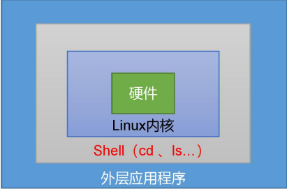
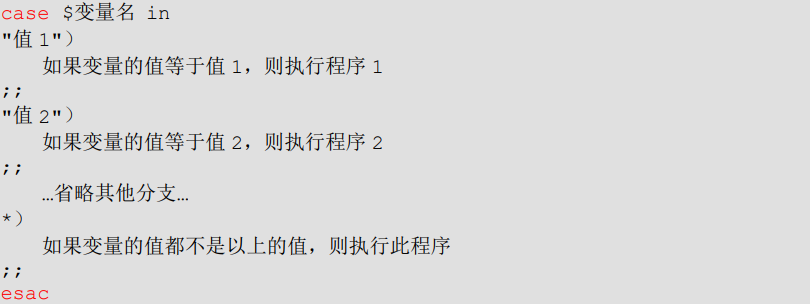
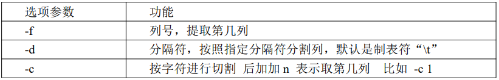
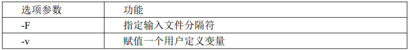
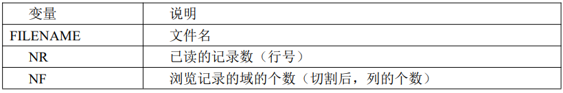

# Shell

## 一、Shell 概述

Shell 是一个**命令行解释器**，它接收应用程序/用户命令，然后调用操作系统内核。



Shell 还是一个功能相当强大的编程语言，易编写、易调试、灵活性强

- Linux 提供的 Shell 解析器有

  `[root@linux100 ~]# cat /etc/shells 
  /bin/sh
  /bin/bash
  /usr/bin/sh
  /usr/bin/bash
  /bin/tcsh
  /bin/csh`

- bash 和 sh 的关系

  `[root@linux100 ~]# ls -l /bin/ | grep bash
  -rwxr-xr-x. 1 root root     964536 11月 25 00:33 bash
  lrwxrwxrwx. 1 root root         10 5月   2 13:55 bashbug -> bashbug-64
  -rwxr-xr-x. 1 root root       6964 11月 25 00:33 bashbug-64
  lrwxrwxrwx. 1 root root          4 5月   2 13:55 sh -> bash`

- CentOS 默认的解析器是 bash

  `[root@linux100 ~]# echo $SHELL
  /bin/bash`

## 二、Shell 脚本入门

### 2.1 脚本格式

脚本以 **#!/bin/bash** 开头（指定解析器）

### 2.2 第一个 Shell 脚本：helloworld.sh

- 需求：创建一个 Shell 脚本，输出 helloworld

- 案例实操

  `#!/bim/bash
  echo "hello,world"`

- 脚本的常用执行方式

  - 第一种：采用 bash 或 sh+脚本的相对路径或绝对路径（不用赋予脚本+x 权限）

    bash + 脚本的相对路径

    `[root@linux100 scripts]# bash hello.sh 
    hello,world`

    bash + 脚本的绝对路径

    `[root@linux100 scripts]# bash /root/scripts/hello.sh 
    hello,world`

    sh 同上

  - 第二种：采用输入脚本的绝对路径或相对路径执行脚本（必须具有可执行权限 +x）

    - 首先要赋予 hello.sh 脚本的 +x 权限
    - 执行脚本

    相对路径

    `[root@linux100 ~]# scripts/hello.sh 
    hello,world`

    

    `[root@linux100 scripts]# ./hello.sh 
    hello,world`

    绝对路径

    `[root@linux100 ~]# /root/scripts/hello.sh 
    hello,world`

  - 第三种：在脚本的路径前加上"."或者"source"

    `[root@linux100 scripts]# . hello.sh 
    hello,world
    [root@linux100 scripts]# source hello.sh 
    hello,world`

> 注意：第一种执行方法，本质是 bash 解析器帮你执行脚本，所以脚本本身不需要执行权限。第二种执行方法，本质是脚本需要自己执行，所以需要执行权限。

前两种方式都是在当前 shell 中打开一个子 shell 来执行脚本内容，当脚本内容结束，则 子 shell 关闭，回到父 shell 中。 

第三种，也就是使用在脚本路径前加“ . ”或者 source 的方式，可以使脚本内容在当前 shell 里执行，而无需打开子 shell！这也是为什么我们每次要修改完/etc/profile 文件以后，需要 source 一下的原因。 

开子 shell 与不开子 shell 的区别就在于，环境变量的继承关系，如在子 shell 中设置的当前变量，父 shell 是不可见的。

## 三、变量

### 3.1 系统预定义变量

- 常用系统变量

  $HOME、 $PWD、$SHELL、$USER等

- 案例实操

  - 查看系统变量的值

    `[root@linux100 scripts]# echo $HOME
    /root`

  - 显示当前 Shell 中所有变量：set

    `[root@linux100 scripts]# set`

### 3.2 自定义变量

- 基本语法

  - 定义变量：变量名=变量值，注意，**= 号前后不能有空格**
  - 撤销变量：unset 变量名
  - 声明静态变量：readonly 变量名，注意：不能unset

- 变量定义规则

  - 变量名称可以由字母、数字和下划线组成，但不能以数字开头，**环境变量名建议大写**
  - 等号两侧不能有空格
  - 在 bash 中，变量默认类型都是字符串类型，无法直接进行数值运算
  - 变量的值如果有空格，需要使用双引号或单引号括起来

- 案例实操

  - 定义变量A

    `[root@linux100 scripts]# a=2
    [root@linux100 scripts]# echo $a
    2`

  - A重新赋值

    `[root@linux100 scripts]# my_var=hello
    [root@linux100 scripts]# echo $my_var
    hello
    [root@linux100 scripts]# my_var=Hello
    [root@linux100 scripts]# echo $my_var
    Hello`

  - 变量有空格

    `[root@linux100 scripts]# my_var="hello world"
    [root@linux100 scripts]# echo $my_var
    hello world`

  - 升级成全局变量 子 shell 中更改不会改变全局变量，即使升级为全局变量也不行

    `[root@linux100 scripts]# export my_var
    [root@linux100 scripts]# env | grep my_var
    my_var=hello world`

  - 默认定义的是字符串，无法进行数值计算

    `[root@linux100 scripts]# a=1+5
    [root@linux100 scripts]# echo $a
    1+5`

  - 如果想要数值计算，要+括号

    `[root@linux100 scripts]# a=$((1+5))
    [root@linux100 scripts]# echo $a
    6
    [root@linux100 scripts]# a=$[5+9]
    [root@linux100 scripts]# echo $a
    14`

  - 只读变量

    `[root@linux100 scripts]# readonly b=5
    [root@linux100 scripts]# b=10
    -bash: b: 只读变量`

  - 撤销变量

    `[root@linux100 scripts]# unset a`

  - 无法撤销只读变量 相当于常量

    `[root@linux100 scripts]# unset b
    -bash: unset: b: 无法反设定: 只读 variable`

### 3.3 特殊变量

#### ①$n

- 基本语法

  - $n （功能描述：n 为数字，$0 代表该脚本名称，$1-$9 代表第一到第九个参数，十以上的参数，十以上的参数需要用大括号包含，如 ${10}）

- 实操案例

  ```shell
  #!/bin/bash
  echo "hello,world"
  echo "hello, $1"
  ```

  `[root@linux100 scripts]# ./hello.sh xiaoming
  hello,world
  hello, xiaoming`

  ```shell
  #!/bin/bash
  echo '============$n==============='
  echo script name:$0
  echo 1st parameter:$1
  echo 2st parameter:$2
  ```

  `[root@linux100 scripts]# ./parameter.sh abc def
  ============$n===============
  script name:./parameter.sh
  1st parameter:abc
  2st parameter:def`

#### ②$#

- 基本用法

  - $# （功能描述：获取所有**输入参数个数**， 常用于循环，判断参数的个数是否正确以及加强脚本的健壮性）

- 案例实操

  ```shell
  #!/bin/bash
  echo '============$n==============='
  echo script name:$0
  echo 1st parameter:$1
  echo 2st parameter:$2
  echo '============$#==============='
  echo parameters numbers:$#
  ```

  `[root@linux100 scripts]# ./parameter.sh asd dwd qqq
  ============$n===============
  script name:./parameter.sh
  1st parameter:asd
  2st parameter:dwd
  ============$#===============
  parameters numbers:3`

#### ③$*、$@

- 基本语法

  - $* （功能描述：这个变量代表命令行中所有的参数，**$\*把所有的参数看成一个整体**）
  - $@ （功能描述：这个变量也代表命令行中所有的参数，不过**$@把每个参数区分对待**）

- 案例实操

  ```shell
  #!/bin/bash
  echo '============$n==============='
  echo script name:$0
  echo 1st parameter:$1
  echo 2st parameter:$2
  echo '============$#==============='
  echo parameters numbers:$#
  echo '============$*==============='
  echo $*
  echo '============$@==============='
  echo $@
  ```

  `[root@linux100 scripts]# ./parameter.sh abc wdw ddd 12
  ============$n===============
  script name:./parameter.sh
  1st parameter:abc
  2st parameter:wdw
  ============$#===============
  parameters numbers:4
  ============$*===============
  abc wdw ddd 12
  ============$@===============
  abc wdw ddd 12`

#### ④$?

- 基本语法

  - $? （功能描述：最后一次执行的命令的返回状态。如果这个变量的值为 0，证明上一 个命令正确执行；如果这个变量的值为非 0（具体是哪个数，由命令自己来决定），则证明上一个命令执行不正确了。）

- 案例实操

  - 判断 hello.sh 脚本是否正确执行

    `[root@linux100 scripts]# ./hello.sh
    hello,world
    hello, 
    [root@linux100 scripts]# echo $?
    0
    [root@linux100 scripts]# hello.sh
    bash: hello.sh: 未找到命令...
    [root@linux100 scripts]# echo $?
    127`

## 四、运算符

- 基本语法

  - "$((运算式))" 或 "$[运算式]"

- 案例实操

  - 计算 5 * 2

    `[root@linux100 scripts]# expr 5 \* 2
    10`

    `[root@linux100 scripts]# echo $[5*2]
    10`

  - 计算 5 * 2 并赋值

    `[root@linux100 scripts]# a=$(expr 5 \* 2)
    [root@linux100 scripts]# echo $a
    10`

    `[root@linux100 scripts]# a=$[5*2]
    [root@linux100 scripts]# echo $a
    10`

    ```shell
    [root@linux100 scripts]# a=`expr 5 \* 2`
    [root@linux100 scripts]# echo $a
    10
    ```

  - 计算（3+5）*4 的值

    `[root@linux100 scripts]# s=$[(3+5)*4]
    [root@linux100 scripts]# echo $s
    32`

  - 使用 shell 脚本

    ```shell
    #!/bin/bash
    sum=$[$1 + $2]
    echo sum=$sum
    ```

    `[root@linux100 scripts]# ./add.sh 1 2
    sum=3`

## 五、条件判断

- 基本语法

  - test condition
  - [ condition ] （**注意：condition前后要有空格**）

  注意：条件非空即为 true，[ hy ] 返回 true，[  ] 返回 false

- 常用判断条件

  - 两个整数之间比较

    - -eq 等于（equal）
    - -ne 不等于 （not equal）
    - -lt 小于 （less than）
    - -le 小于等于 （less equal）
    - -gt 大于 （greater than）
    - -ge 大于等于 （greater equal）

    注意：如果是字符串之间的比较，用等号“=”判断相等；用“!=”判断不等。

  - 按照文件权限进行判断

    - -r 有读的权限 （read）
    - -w 有写的权限 （write）
    - -x 有执行的权限 （execute）

  - 按照文件类型进行判断

    - -e 文件存在 （existence）
    - -f 文件存在并且是一个常规文件（file）
    - -d 文件存在并且是一个目录 （directory）

- 案例实操

  - a == hello $?为0 表示 true 为1 表示 false

    `[root@linux100 scripts]# a=hello
    [root@linux100 scripts]# test $a = hello
    [root@linux100 scripts]# echo $?
    0
    [root@linux100 scripts]# test $a = Hello
    [root@linux100 scripts]# echo $?
    1`

    `[root@linux100 scripts]# [ $a = Hello ]
    [root@linux100 scripts]# echo $?
    0
    [root@linux100 scripts]# [ $a = hello ]
    [root@linux100 scripts]# echo $?
    1`

  - [  ]为空时为 false 有值时为 true

    `[root@linux100 scripts]# [  ]
    [root@linux100 scripts]# echo $?
    1
    [root@linux100 scripts]# [ 1 ]
    [root@linux100 scripts]# echo $?
    0`

  - a 与 Hello 的不相等判断

    `[root@linux100 scripts]# a=Hello
    [root@linux100 scripts]# [ $a != Hello ]
    [root@linux100 scripts]# echo $?
    1
    [root@linux100 scripts]# [ $a != hello ]
    [root@linux100 scripts]# echo $?
    0`

  - 数值的相等不相等判断

    - 这里相当于字符串比较

    `[root@linux100 scripts]# [ 2 = 2 ]
    [root@linux100 scripts]# echo $?
    0
    [root@linux100 scripts]# [ 2 != 2 ]
    [root@linux100 scripts]# echo $?
    1`

    - 这里相当于数值比较

    `[root@linux100 scripts]# [ 2 -eq 2 ]
    [root@linux100 scripts]# echo $?
    0
    [root@linux100 scripts]# [ 2 -ne 2 ]
    [root@linux100 scripts]# echo $?
    1`

  - 文件权限

    `[root@linux100 scripts]# ll
    总用量 12
    -rwxr-xr-x. 1 root root  39 5月   3 21:13 add.sh
    -rwxr-xr-x. 1 root root  48 5月   3 20:42 hello.sh
    -rwxr-xr-x. 1 root root 267 5月   3 20:57 parameter.sh
    -rw-r--r--. 1 root root   0 5月   3 21:32 test
    [root@linux100 scripts]# [ -r hello.sh ]
    [root@linux100 scripts]# echo $?
    0
    [root@linux100 scripts]# [ -w hello.sh ]
    [root@linux100 scripts]# echo $?
    0
    [root@linux100 scripts]# [ -r test ]
    [root@linux100 scripts]# echo $?
    0
    [root@linux100 scripts]# [ -x test ]
    [root@linux100 scripts]# echo $?
    1`

  - 文件类型

    `[root@linux100 scripts]# ll
    总用量 12
    -rwxr-xr-x. 1 root root  39 5月   3 21:13 add.sh
    -rwxr-xr-x. 1 root root  48 5月   3 20:42 hello.sh
    drwxr-xr-x. 2 root root   6 5月   3 21:35 info
    -rwxr-xr-x. 1 root root 267 5月   3 20:57 parameter.sh
    -rw-r--r--. 1 root root   0 5月   3 21:32 test
    [root@linux100 scripts]# [ -e test1 ]
    [root@linux100 scripts]# echo $?
    1
    [root@linux100 scripts]# [ -f hello.sh ]
    [root@linux100 scripts]# echo $?
    0
    [root@linux100 scripts]# [ -d info ]
    [root@linux100 scripts]# echo $?
    0`

    `[root@linux100 scripts]# [ -f info ]
    [root@linux100 scripts]# echo $?
    1`

  - 多条件组合判断（&& 表示前一条命令执行成功时，才执行后一条命令，|| 表示上一条命令执行失败后，才执行下一条命令）

    `[root@linux100 scripts]# a=15
    [root@linux100 scripts]# [ $a -lt 20 ] && echo "$a < 20" || echo "$a >= 20"
    15 < 20`

    `[root@linux100 scripts]# a=21
    [root@linux100 scripts]# [ $a -lt 20 ] && echo "$a < 20" || echo "$a >= 20"
    21 >= 20`

## 六、流程控制

### 6.1 if 判断

- 基本语法
  - 单分支
  
    `[root@linux100 ~]# a=25
    [root@linux100 ~]# if [ $a -gt 18 ]; then echo OK; fi
    OK`
  
    **shell 脚本 优化：加个 x，如果没有参数不会报错**
  
    ```shell
    #!/bin/bash
    if [ "$!"x = "hy"x ]
    then 
             echo "welcome, hy"
    fi
    ```
  
    `[root@linux100 scripts]# ./if_test.sh hy
    welcome, hy`
  
    **两个条件且 -a 相当于 and**
  
    `[root@linux100 scripts]# if [ $a -gt 18 -a $a -lt 35 ]; then echo OK; fi
    OK`
  
  - 多分支
  
    **双分支**
  
    ```shell
    #!/bin/bash
    if [ "$1"x = "hy"x ]
    then
             echo "welcome, hy"
    fi
    # 输入第二个参数表示年龄，判断属于哪个年龄段
    if [ $2 -lt 18 ]
    then
            echo "未成年人"
    else
            echo "成年人"
    fi
    ```
  
    `[root@linux100 scripts]# ./if_test.sh hy 15
    welcome, hy
    未成年人
    [root@linux100 scripts]# ./if_test.sh hy 19
    welcome, hy
    成年人`
  
    **多分支**
  
    ```shell
    #!/bin/bash
    if [ "$1"x = "hy"x ]
    then
             echo "welcome, hy"
    fi
    # 输入第二个参数表示年龄，判断属于哪个年龄段
    if [ $2 -lt 18 ]
    then
            echo "未成年人"
    elif [ $2 -lt 35 ]
    then
            echo "青年人"
    elif [ $2 -lt 60 ]
    then
            echo "中年人"
    else
            echo "老年人"
    fi
    ```
  
    `[root@linux100 scripts]# ./if_test.sh hy 19
    welcome, hy
    青年人
    [root@linux100 scripts]# ./if_test.sh hy 44
    welcome, hy
    中年人
    [root@linux100 scripts]# ./if_test.sh hy 33
    welcome, hy
    青年人
    [root@linux100 scripts]# ./if_test.sh hy 337
    welcome, hy
    老年人`

> **注意**：
>
> ①[ 条件判断式 ]，中括号和条件判断式之间必须有空格
>
> ②if 后要有空格

### 6.2 case 语句

- 基本语法

  

> **注意**：
>
> ①case 行尾必须为单词“in”，每一个模式匹配必须以右括号“ ) "结束
>
> ②双分号“ ;; ”表示命令序列结束，相当于 java 中的 break
>
> ③最后的" *) "表示默认模式，相当于 java 中的 default

- 案例实操

  ```shell
  #!/bin/bash
  
  case $1 in
  1)
          echo one
  ;;
  2)
          echo two
  ;;
  3)
          echo three
  ;;
  *)
          echo $1
  esac
  ```

  `[root@linux100 scripts]# ./case_test.sh 1
  one
  [root@linux100 scripts]# ./case_test.sh 2
  two
  [root@linux100 scripts]# ./case_test.sh 3
  three
  [root@linux100 scripts]# ./case_test.sh 4
  4`

### 6.3 for 循环

- 基本语法

  ```shell
  for (( 初始值;循环控制条件;变量变化 ))
  do 
  	程序
  done
  ```

- 案例实操（**在双小括号里就可以使用数学运算式**）

  ```shell
  #!/bin/bash
  
  for (( i=0; i <= $1; i++ ))
  do
          sum=$[ $sum + $i ]
  done
  echo $sum   
  ```

  `[root@linux100 scripts]# ./sum_to.sh 10
  55`

- 基本语法2

  ```shell
  for 变量 in 值1 值2 值3...
  do
  	程序
  done
  ```

- 案例实操

  `[root@linux100 scripts]# for os in linux windows macos; do echo $os; done
  linux
  windows
  macos`

  **{1..100} 表示1到100的值**

  `[root@linux100 scripts]# for i in {1..100}; do sum=$[ $sum + $i ]; done; echo $sum
  5050`

  **比较 $* 和 $@ 区别**("$*"双引号引起变成一个参数)

  ```shell
  #!/bin/bash
  
  echo '=========$*========='
  for para in $*
  do
          echo $para
  done
  echo '=========$@========='
  for para in $@
  do
          echo $para
  done
  ```

  `[root@linux100 scripts]# ./parameter_for_test.sh a b c d e 1
  =========$*=========
  a
  b
  c
  d
  e
  1
  =========$@=========
  a
  b
  c
  d
  e
  1`

  ```shell
  #!/bin/bash
  
  echo '=========$*========='
  for para in "$*"
  do
          echo $para
  done
  echo '=========$@========='
  for para in "$@"
  do
          echo $para
  done
  ```

  `[root@linux100 scripts]# ./parameter_for_test.sh a b c d e 1
  =========$*=========
  a b c d e 1
  =========$@=========
  a
  b
  c
  d
  e
  1`

### 6.4 while 循环

- 基本语法

  ```shell
  while [ 条件判断式 ]
  do
  	程序
  done
  ```

- 案例实操

  ```shell
  #!/bin/bash
  
  # 用 for 进行实现
  for (( i=0; i <= $1; i++ ))
  do
          sum=$[ $sum + $i ]
  done
  echo $sum       
  
  # 用 while 进行实现
  a=1
  while [ $a -le $1 ]
  do
          sum2=$[ $sum2 + $a ]
          a=$[ $a + 1 ]
  done
  echo $sum2
  ```

  `[root@linux100 scripts]# ./sum_to.sh 100
  5050
  5050`

  **优化**

  ```shell
  #!/bin/bash
  
  # 用 for 进行实现
  for (( i=0; i <= $1; i++ ))
  do
          sum=$[ $sum + $i ]
  done
  echo $sum       
  
  # 用 while 进行实现
  a=1
  while [ $a -le $1 ]
  do
  #       sum2=$[ $sum2 + $a ]
  #       a=$[ $a + 1 ]
          let sum2+=a
          let a++
  done
  echo $sum2
  ```

## 	七、read 读取控制台输入

- 基本语法

  - read (选项) (参数)
    - 选项
      - -p：指定读取值时的提示符：
      - -t：指定读取值时等待的时间（秒），如果不加 -t 表示一直等待
    - 参数
      - 变量：指定读取值的变量名

- 案例实操

  ```shell
  #!/bin/bash
  
  read -t 10 -p "请输入您的芳名：" name
  echo "welcome, $name"
  ```

  `[root@linux100 scripts]# ./read_test.sh 
  请输入您的芳名：hy
  welcome, hy`

  **优化**

  ```shell
  #!/bin/bash
  
  read -t 3 -p "请输入您的芳名：" name
  if [ $name ]
  then
          echo "welcome, $name"
  else
          echo "sorry"
  fi
  ```

## 八、函数

### 8.1 系统函数

#### ①basename

- 基本语法
  - basename [string / pathname] [suffix] （功能描述：basename 命令会删掉所有的前缀包括最后一个（'/'）字符，然后将字符串显示出来）
  - basename 可以理解为取路径里的文件名称
- 选项说明：
  - suffix 为后缀，如果 suffix 被指定了，basename 会将 pathname 或 string 中的 suffix 去掉。

- 案例实操

  `[root@linux100 scripts]# basename /root/scripts/paramter.sh
  paramter.sh
  [root@linux100 scripts]# basename /root/scripts/paramter.sh .sh
  paramter`

  **shell 脚本**

  ```shell
  #!/bin/bash
  echo '============$n==============='
  echo script name:$(basename $0 .sh)
  echo 1st parameter:$1
  echo 2st parameter:$2
  echo '============$#==============='
  echo parameters numbers:$#
  echo '============$*==============='
  echo $*
  echo '============$@==============='
  echo $@
  
  [root@linux100 scripts]# ./parameter.sh 
  ============$n===============
  script name:parameter
  1st parameter:
  2st parameter:
  ============$#===============
  parameters numbers:0
  ============$*===============
  
  ============$@===============
  
  ```

#### ②dirname

- 基本语法

  - dirname 文件绝对路径 （功能描述：从给定的包含绝对路径的文件名中去除文件名（非目录的部分），然后返回剩下的路径（目录部分））
  - dirname 可以理解为取文件路径的绝对路径名称

- 案例实操

  `[root@linux100 scripts]# dirname /root/scripts/parameter.sh
  /root/scripts`

  `[root@linux100 scripts]# dirname ../scripts/parameter.sh
  ../scripts`

  **shell 脚本**（dirname 只是个简单的字符串切割）

  ```shell
  #!/bin/bash
  echo '============$n==============='
  echo script name:$(basename $0 .sh)
  echo script path:$(cd $(dirname $0); pwd)
  echo 1st parameter:$1
  echo 2st parameter:$2
  echo '============$#==============='
  echo parameters numbers:$#
  echo '============$*==============='
  echo $*
  echo '============$@==============='
  echo $@
  
  [root@linux100 ~]# /root/scripts/parameter.sh 
  ============$n===============
  script name:parameter
  script path:/root/scripts
  1st parameter:
  2st parameter:
  ============$#===============
  parameters numbers:0
  ============$*===============
  
  ============$@===============
  
  ```

### 8.2 自定义函数

- 基本语法

  ```shell
  [ function ] funname[()]
  {
  	Action;
  	[return int;]
  }
  ```

- 经验技巧

  - 必须在调用函数地方之前，先声明函数，shell 脚本是逐行运行。不会像其它语言一样先编译。
  - 函数返回值，只能通过 $? 系统变量获得，可以显示加：renturn 返回，如果不加，将以最后一条命令运行结果，作为返回值。return 后跟数值 n(0~255)

- 案例实操

  ```shell
  #!/bin/bash
  
  function add()
  {
          sum=$[$1+$2]
          echo $sum
  }
  
  read -p "请您输入一个整数：" a
  read -p "请您输入一个整数：" b
  
  sum=$(add $a $b)
  echo "和："$sum
  ```

  `[root@linux100 scripts]# ./fun_test.sh 
  请您输入一个整数：1
  请您输入一个整数：2
  和：3`

## 九、正则表达式入门

​		正则表达式使用单个字符串来描述、匹配一系列符合某个语法规则的字符串。在很多文本编辑器里，正则表达式通常被用来检索、替换那些符合某个模式的文本。在 Linux 中，grep， sed，awk 等文本处理工具都支持通过正则表达式进行模式匹配。

### 9.1 常规匹配

​		一串不包含特殊字符的正则表达式匹配它自己，例如：

`[root@linux100 scripts]# cat /etc/passwd | grep hy
hy:x:1000:10:hy:/home/hy:/bin/bash`

​		就会匹配所有包含 hy 的行。

### 9.2 常用特殊字符

#### ①特殊字符：^

- 匹配一行的开头，例如

  `[root@linux100 scripts]# cat /etc/passwd | grep ^a
  adm:x:3:4:adm:/var/adm:/sbin/nologin
  abrt:x:173:173::/etc/abrt:/sbin/nologin
  avahi:x:70:70:Avahi mDNS/DNS-SD Stack:/var/run/avahi-daemon:/sbin/nologin`

  会匹配所有以 a 开头的行

#### ②特殊字符：$

- 匹配一行的结束，例如

  `[root@linux100 scripts]# cat /etc/passwd | grep bash$
  root:x:0:0:root:/root:/bin/bash
  hy:x:1000:10:hy:/home/hy:/bin/bash
  tony:x:1001:1003::/home/tony:/bin/bash
  david:x:1002:1003::/home/dave:/bin/bash
  xiaoming:x:1003:1004::/home/xiaoming:/bin/bash
  xiaoliang:x:1004:1004::/home/xiaoliang:/bin/bash
  xiaohong:x:1005:1005::/home/xiaohong:/bin/bash
  xiaolan:x:1006:1004::/home/xiaolan:/bin/bash`

  会匹配所有以 bash 结尾的行

> 思考：**^$ 匹配什么**
>
> 匹配空行

#### ③特殊字符：.

- 匹配一个任意的字符，例如

  `[root@linux100 scripts]# cat /etc/passwd | grep r..t
  root:x:0:0:root:/root:/bin/bash
  operator:x:11:0:operator:/root:/sbin/nologin
  ftp:x:14:50:FTP User:/var/ftp:/sbin/nologin`

  会匹配包含 rxxt 的所有行，x表示任意字符

#### ④特殊字符：*

- **不单独使用**，他和上一个字符连用，表示匹配上一个字符 0 次或多次，例如

  `[root@linux100 scripts]# cat /etc/passwd | grep ro*t
  root:x:0:0:root:/root:/bin/bash
  operator:x:11:0:operator:/root:/sbin/nologin
  abrt:x:173:173::/etc/abrt:/sbin/nologin
  rtkit:x:172:172:RealtimeKit:/proc:/sbin/nologin`

  会匹配包含 rt rot root rooot roooot... 的所有行

> 思考：**.\* 匹配什么**
>
> 任意一个字符出现任意次
>
> `[root@linux100 scripts]# cat /etc/passwd | grep ^h.*bash$
> hy:x:1000:10:hy:/home/hy:/bin/bash`
>
> 开头是h，结尾是bash的所有行

#### ⑤字符区间（中括号）：**[ ]**

- [] 表示匹配某个范围内的一个字符

- [6,8] --- 匹配 6 或者 8

- [0-9] --- 匹配一个 0-9 的数字

- [0-9]* --- 匹配任意长度的数字字符串

- [a-z] --- 匹配一个 a-z 之间的字符

- [a-z]* --- 匹配任意长度的字母字符串

- [a-c, e-f] --- 匹配 a-c 或者 e-f 之间的任意字符

  `[root@linux100 scripts]# cat /etc/passwd | grep r[a,b]t
  operator:x:11:0:operator:/root:/sbin/nologin
  sshd:x:74:74:Privilege-separated SSH:/var/empty/sshd:/sbin/nologin`

#### ⑥特殊字符：\

​		\ 表示转义，并不会单独使用。由于所有特殊字符都有其特定匹配模式，当我们想匹配某一特殊字符本身时（例如，我想找出所有包含 '$' 的行），就会碰到困难。此时我们就要将转义字符和特殊字符连用，来表示特殊字符本身，例如

`[root@linux100 scripts]# cat daily_archive.sh | grep '\$'
if [ $# -ne 1 ]
if [ -d $1 ]
DIR_NAME=$(basename $1)`

​		就会匹配所有包含 $ 的行。**注意需要使用单引号将表达式引起来**。

## 十、文本处理工具

### 10.1 cut

​		cut 的工作就是“剪”，具体的说就是在文件中负责剪切数据用的。cut 命令从文件的每一行剪切字节、字符和字段并将这些字节、字符和字段输出。

- 基础用法

  - cut [选项参数] filename
  - 说明：默认分隔符是制表符

- 选项参数说明

  

- 案例实操

  - 数据准备

    ```shell
    [atguigu@hadoop101 shells]$ touch cut.txt
    [atguigu@hadoop101 shells]$ vim cut.txt
    dong shen
    guan zhen
    wo wo
    lai lai
    le le
    ```

  - 切割 cut.txt 第一列

    `[root@linux100 scripts]# cut -d " " -f 1 cut.txt 
    dong
    guan
    wo
    lai
    le`

  - 切割 cut.txt 第二、三列

    `[root@linux100 scripts]# cut -d " " -f 2,3 cut.txt 
    shen
    zhen
    wo
    lai
    le`

  - 在 cut.txt 文件中切割出 guan

    `[root@linux100 scripts]# cat cut.txt | grep guan | cut -d " " -f 1
    guan`

  - 选取系统 PATH 变量值，第 2 个“：”开始后的所有路径：（3- 表示第三列及后面都要）

    `[root@linux100 scripts]# echo $PATH | cut -d ":" -f 3-
    /usr/sbin:/usr/bin:/root/bin`

  - 切割 ifconfig 后打印的 IP 地址

    `[root@linux100 scripts]# ifconfig ens33 | grep netmask | cut -d " " -f 10
    192.168.171.100`

### 10.2 awk

​		一个强大的文本分析工具，把文件逐行的读入，以空格为默认分隔符将每行切片，切开 的部分再进行分析处理。

- 基本用法

  - awk [选项参数] '/pattern1/{action1} /pattern2/{action}...' filename
  - pattern：表示 awk 在数据中查找的内容，就是匹配模式
  - action：在找到匹配内容时所执行的一系列命令

- 选项参数说明

  

- 案例实操

  - 搜索 passwd 文件以 root 关键字开头的所有行，并输出该行的第 7 列。

    `[root@linux100 scripts]# cat /etc/passwd | awk -F ":" '/^root/ {print $7}'
    /bin/bash`

  - 搜索 passwd 文件以 root 关键字开头的所有行，并输出该行的第 1 列和第 7 列， 中间以“，”号分割。

    `[root@linux100 scripts]# cat /etc/passwd | awk -F ":" '/^root/ {print $1","$7}'
    root,/bin/bash`

    **注意：只有匹配了 pattern 才会执行 action**

  - 只显示 /etc/passwd 的第一列和第七列，以逗号分割，且在所有行前面添加列名 user， shell 在最后一行添加"end of file"。

    `[root@linux100 scripts]# cat /etc/passwd | awk -F ":" 'BEGIN{print "user,shell"} {print $1","$7} END{print "end of file"}'`

    **注意：BEGIN 在所有数据读取行之前执行；END 在所有数据执行之后执行。**

  - 将 passwd 文件中的用户 id 增加数值 1 并输出

    `[root@linux100 scripts]# cat /etc/passwd | awk -F ":" '{print $3+1}'`

    使用自定义变量

    `[root@linux100 scripts]# cat /etc/passwd | awk -v i=1 -F ":" '{print $3+i}'`

- awk 的内置变量

  

- 案例实操

  - 统计 passwd 文件名，每行的行号，每行的列号

    `[root@linux100 scripts]# cat /etc/passwd | awk -F ":" '{print "文件名："FILENAME " 行号："NR " 列数："NF}'`

    **因为是管道操作，所有文件名是 - **

  - 查询 ifconfig 命令输出结果中的空行所在的行号

    `[root@linux100 scripts]# ifconfig | awk '/^$/ {print NR}'
    9
    18
    26`

  - 切割 IP（切割符：“ ”）

    `[root@linux100 scripts]# ifconfig | awk '/netmask/ {print $2}'
    192.168.171.100
    127.0.0.1
    192.168.122.1`

## 十一、综合应用案例

### 11.1 归档文件

实际生产应用中，往往需要对重要数据进行归档备份。 

需求：实现一个每天对指定目录归档备份的脚本，输入一个目录名称（末尾不带/）， 将目录下所有文件按天归档保存，并将归档日期附加在归档文件名上，放在/root/archive 下。 

这里用到了归档命令：tar 

后面可以加上-c 选项表示归档，加上-z 选项表示同时进行压缩，得到的文件后缀名 为.tar.gz。 

脚本实现如下：

```shell
#!/bin/bash

# 首先判断输入参数个数是否为1
if [ $# -ne 1 ]
then
        echo "参数个数错误，应该输入一个参数为归档目录名"
        exit
fi

# 从参数中获取目录名称
if [ -d $1 ]
then
        echo
else
        echo
        echo "目录不存在！"
        echo
        exit
fi

# 需要归档的文件名和绝对路径
DIR_NAME=$(basename $1)
DIR_PATH=$(cd $(dirname $1); pwd)

# 获取当前日期
DATE=$(date +%y%m%d)

# 定义生成的归档文件名称
FILE=archive_${DIR_NAME}_$DATE.tar.gz
DEST=/root/archive/$FILE

# 开始归档目录文件
echo "开始归档..."
echo

tar -czf $DEST $DIR_PATH/$DIR_NAME

if [ $? -eq 0 ]
then
        echo
        echo "归档成功"
        echo "归档文件为：$DEST"
        echo
else
        echo "归档出现问题"
        echo
fi

exit

[root@linux100 scripts]# ./daily_archive.sh ../scripts

开始归档...

tar: 从成员名中删除开头的“/”

归档成功
归档文件为：/root/archive/archive_scripts_220504.tar.gz
```

**最后可以通过 crontab -e 设置定时任务，在固定时间执行脚本**

### 11.2 发送消息

​		我们可以利用 Linux 自带的 mesg 和 write 工具，向其它用户发送消息。 

​		需求：实现一个向某个用户快速发送消息的脚本，输入用户名作为第一个参数，后面直接跟要发送的消息。脚本需要检测用户是否登录在系统中、是否打开消息功能，以及当前发送消息是否为空。 

​		脚本实现如下：（-z 判断是否为空）

```shell
#!/bin/bash

# 查看用户是否登录
login_user=$(who | grep -i -m 1 $1 | awk '{print $1}')

if [ -z $login_user ]
then
	echo "$1 不在线！"
	echo "脚本退出..."
	exit
fi

# 查看用户是否开启消息功能
is_allowed=$(who -T | grep -i -m 1 $1 | awk '{print $2}')

if [ $is_allowed != "+" ]
then
	echo "$1 没有开启消息功能！"
	echo "脚本退出..."
	exit
fi

# 确认是否有消息发生
if [ -z $2 ]
then
	echo "没有消息发送！"
	echo "脚本退出..."
	exit
fi

# 从参数中获取要发送的消息
whole_msg=$(echo $* | cut -d " " -f 2-)

# 获取用户登录的终端
user_terminal=$(who | grep -i -m 1 $1 | awk '{print $2}')

# 写入要发送的消息
echo $whole_msg | write $login_user $user_terminal

if [ $? != 0 ]
then
	echo "发送失败！"
else
	echo "发送成功！"
fi

exit
```

`[root@linux100 scripts]# ./send_message.sh hy hi,hy
发送成功！`


